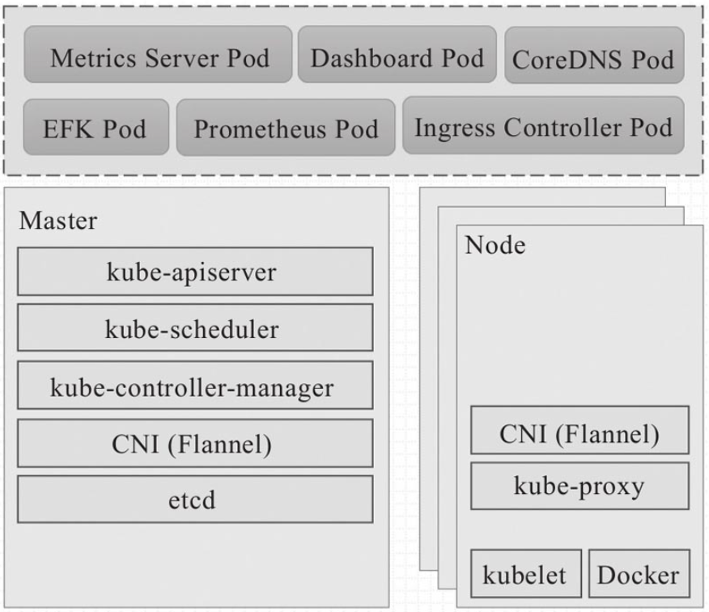
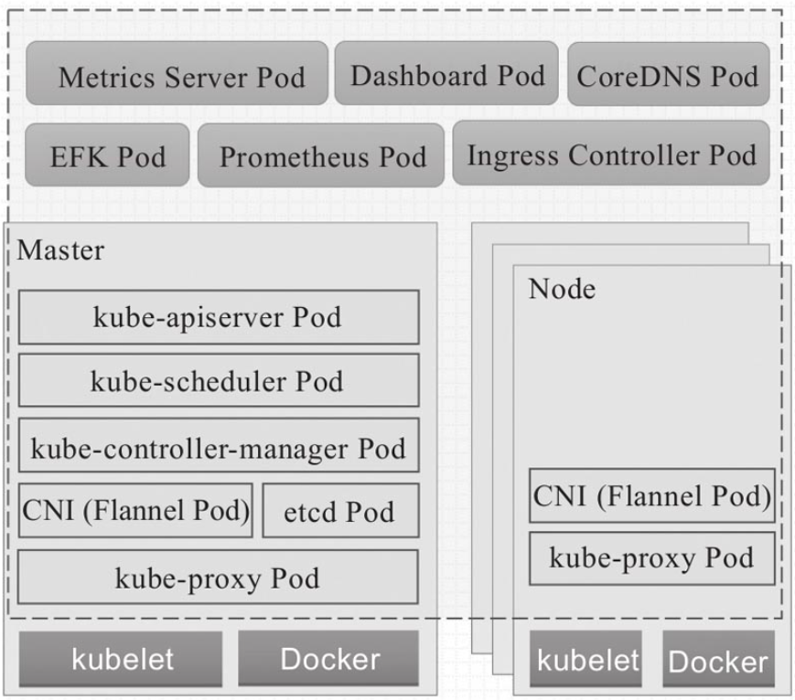
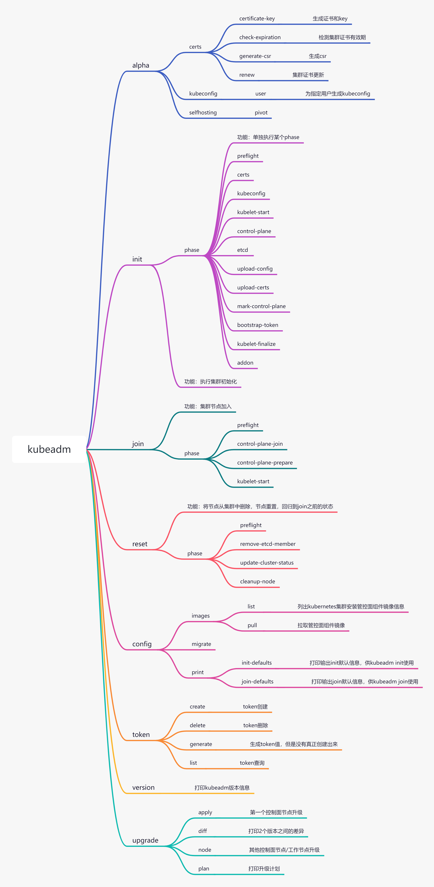

# kubeadm源码分析

## 1 介绍

​	kubeadm是kubernetes社区提供的集群构建工具，它负责构建一个最小化可用集群，简单而言，kubeadm是kubernetes集群全生命周期的管理功能，负责集群的创建，扩缩容，升级，卸载等。

​	kubeadm专注于在现有基础设施上引导kubernets集群启动并执行一系列基本的操作，其功能未涉及底层基础环境的构建，仅仅为集群添加最为要紧的核心组件CoreDNS和kube-proxy。剩下的一些组件，比如ELK，Prometheus，Dashboard等不在kubeadm考虑范围内，通常这些组件都是由集群管理们按需部署。

​	kubeadm的核心功能是kubeadm init和kubeadm join，其中init功能用于创建新的控制平面节点，join功能用于将节点快速连接到指定的控制平面，Kubernetes集群可部署为3种运行模式：

(1) 独立组件模式，即master各组件和worker各组件直接以守护进程方式运行于节点之上，通常以二进制方式部署的集群属于该种类型。



(2) 静态pod方式(**主要部署方式**)：控制平面的各组件以静态pod对象形式运行在master主机上，而node主机上的kubelet和docker运行为系统级守护进程，kube-proxy托管于集群上的daemonset控制器。



(3) 自托管(self-hosted)模式：类似于第二种模式，但控制面的各组件运行为pod对象(非静态模式)，并且这些Pod对象同样托管运行在kubernets集群之上。

本文分析的kubeadm源码是基于kubernetes v1.19.12版本。

## 2 主要功能

```
[root@node1 ~]# ./kubeadm -h


    ┌──────────────────────────────────────────────────────────┐
    │ KUBEADM                                                  │
    │ Easily bootstrap a secure Kubernetes cluster             │
    │                                                          │
    │ Please give us feedback at:                              │
    │ https://github.com/kubernetes/kubeadm/issues             │
    └──────────────────────────────────────────────────────────┘

Example usage:

    Create a two-machine cluster with one control-plane node
    (which controls the cluster), and one worker node
    (where your workloads, like Pods and Deployments run).

    ┌──────────────────────────────────────────────────────────┐
    │ On the first machine:                                    │
    ├──────────────────────────────────────────────────────────┤
    │ control-plane# kubeadm init                              │
    └──────────────────────────────────────────────────────────┘

    ┌──────────────────────────────────────────────────────────┐
    │ On the second machine:                                   │
    ├──────────────────────────────────────────────────────────┤
    │ worker# kubeadm join <arguments-returned-from-init>      │
    └──────────────────────────────────────────────────────────┘

    You can then repeat the second step on as many other machines as you like.

Usage:
  kubeadm [command]

Available Commands:
  alpha       Kubeadm experimental sub-commands
  completion  Output shell completion code for the specified shell (bash or zsh)
  config      Manage configuration for a kubeadm cluster persisted in a ConfigMap in the cluster
  help        Help about any command
  init        Run this command in order to set up the Kubernetes control plane
  join        Run this on any machine you wish to join an existing cluster
  reset       Performs a best effort revert of changes made to this host by 'kubeadm init' or 'kubeadm join'
  token       Manage bootstrap tokens
  upgrade     Upgrade your cluster smoothly to a newer version with this command
  version     Print the version of kubeadm

Flags:
      --add-dir-header           If true, adds the file directory to the header of the log messages
  -h, --help                     help for kubeadm
      --log-file string          If non-empty, use this log file
      --log-file-max-size uint   Defines the maximum size a log file can grow to. Unit is megabytes. If the value is 0, the maximum file size is unlimited. (default 1800)
      --rootfs string            [EXPERIMENTAL] The path to the 'real' host root filesystem.
      --skip-headers             If true, avoid header prefixes in the log messages
      --skip-log-headers         If true, avoid headers when opening log files
  -v, --v Level                  number for the log level verbosity

Use "kubeadm [command] --help" for more information about a command.
```

kubeadm主要支持如下功能：



## 3 源码目录结构

```shell
zhuhao:kubeadm $ tree -L 2 .
.
├── BUILD
├── OWNERS
├── app
│   ├── BUILD
│   ├── apis // 核心数据结构
│   ├── cmd  // 命令行入口
│   ├── componentconfigs
│   ├── constants // 程序常量定义
│   ├── discovery
│   ├── features // features特性功能
│   ├── images // 镜像相关操作
│   ├── kubeadm.go 
│   ├── phases // phase核心功能
│   ├── preflight // preflight核心功能
│   └── util // 帮助类
├── kubeadm.go // 程序主入口
```


## 4 关键数据结构及功能代码逻辑

### 4.1 关键数据结构

#### 4.1.1 InitConfiguration

```go
type InitConfiguration struct {
	metav1.TypeMeta `json:",inline"`

	// `kubeadm init`-only information. These fields are solely used the first time `kubeadm init` runs.
	// After that, the information in the fields IS NOT uploaded to the `kubeadm-config` ConfigMap
	// that is used by `kubeadm upgrade` for instance. These fields must be omitempty.

	// BootstrapTokens is respected at `kubeadm init` time and describes a set of Bootstrap Tokens to create.
	// This information IS NOT uploaded to the kubeadm cluster configmap, partly because of its sensitive nature
    // bootstrap过程token信息
	BootstrapTokens []BootstrapToken `json:"bootstrapTokens,omitempty"`

	// NodeRegistration holds fields that relate to registering the new control-plane node to the cluster
    // 节点注册信息
	NodeRegistration NodeRegistrationOptions `json:"nodeRegistration,omitempty"`

	// LocalAPIEndpoint represents the endpoint of the API server instance that's deployed on this control plane node
	// In HA setups, this differs from ClusterConfiguration.ControlPlaneEndpoint in the sense that ControlPlaneEndpoint
	// is the global endpoint for the cluster, which then loadbalances the requests to each individual API server. This
	// configuration object lets you customize what IP/DNS name and port the local API server advertises it's accessible
	// on. By default, kubeadm tries to auto-detect the IP of the default interface and use that, but in case that process
	// fails you may set the desired value here.
    // APIServer节点信息
	LocalAPIEndpoint APIEndpoint `json:"localAPIEndpoint,omitempty"`

	// CertificateKey sets the key with which certificates and keys are encrypted prior to being uploaded in
	// a secret in the cluster during the uploadcerts init phase.
    // 证书和key信息，主要用在uploadcerts这个工作流，对于需要upload的secret进行加密处理
	CertificateKey string `json:"certificateKey,omitempty"`
}
```

示例：

```yaml
apiVersion: kubeadm.k8s.io/v1beta2
kind: InitConfiguration
bootstrapTokens:
- token: "9a08jv.c0izixklcxtmnze7"           
  description: "kubeadm bootstrap token"          #初始化集群使用的token
  ttl: "24h"
- token: "783bde.3f89s0fje9f38fhf"
  description: "another bootstrap token"          #用于添加node的token
  usages:
  - authentication
  - signing
  groups:
  - system:bootstrappers:kubeadm:default-node-token
nodeRegistration:                                   
  criSocket: /var/run/dockershim.sock
  name: rancher.local
  taints:
  - effect: NoSchedule
    key: node-role.kubernetes.io/master
localAPIEndpoint:                                    # 指定master的监听ip和端口
  advertiseAddress: 1.2.3.4
  bindPort: 6443
```

#### 4.1.2 ClusterConfiguration

```go
// ClusterConfiguration contains cluster-wide configuration for a kubeadm cluster
type ClusterConfiguration struct {
	metav1.TypeMeta `json:",inline"`

	// Etcd holds configuration for etcd.
    // ETCD信息
	Etcd Etcd `json:"etcd,omitempty"`

	// Networking holds configuration for the networking topology of the cluster.
    // 网络信息
	Networking Networking `json:"networking,omitempty"`

	// KubernetesVersion is the target version of the control plane.
    // k8s版本信息
	KubernetesVersion string `json:"kubernetesVersion,omitempty"`

	// ControlPlaneEndpoint sets a stable IP address or DNS name for the control plane; it
	// can be a valid IP address or a RFC-1123 DNS subdomain, both with optional TCP port.
	// In case the ControlPlaneEndpoint is not specified, the AdvertiseAddress + BindPort
	// are used; in case the ControlPlaneEndpoint is specified but without a TCP port,
	// the BindPort is used.
	// Possible usages are:
	// e.g. In a cluster with more than one control plane instances, this field should be
	// assigned the address of the external load balancer in front of the
	// control plane instances.
	// e.g.  in environments with enforced node recycling, the ControlPlaneEndpoint
	// could be used for assigning a stable DNS to the control plane.
	ControlPlaneEndpoint string `json:"controlPlaneEndpoint,omitempty"`

	// APIServer contains extra settings for the API server control plane component
    // kube-apiserver组件信息
	APIServer APIServer `json:"apiServer,omitempty"`

	// ControllerManager contains extra settings for the controller manager control plane component
    // kube-controller-manager组件信息
	ControllerManager ControlPlaneComponent `json:"controllerManager,omitempty"`

	// Scheduler contains extra settings for the scheduler control plane component
    // kube-scheduler组件信息
	Scheduler ControlPlaneComponent `json:"scheduler,omitempty"`

	// DNS defines the options for the DNS add-on installed in the cluster.
    // dns组件信息
	DNS DNS `json:"dns,omitempty"`

	// CertificatesDir specifies where to store or look for all required certificates.
    // 证书目录信息
	CertificatesDir string `json:"certificatesDir,omitempty"`

	// ImageRepository sets the container registry to pull images from.
	// If empty, `k8s.gcr.io` will be used by default; in case of kubernetes version is a CI build (kubernetes version starts with `ci/` or `ci-cross/`)
	// `gcr.io/k8s-staging-ci-images` will be used as a default for control plane components and for kube-proxy, while `k8s.gcr.io`
	// will be used for all the other images.
    // 镜像拉取的repo配置
	ImageRepository string `json:"imageRepository,omitempty"`

	// UseHyperKubeImage controls if hyperkube should be used for Kubernetes components instead of their respective separate images
	// DEPRECATED: As hyperkube is itself deprecated, this fields is too. It will be removed in future kubeadm config versions, kubeadm
	// will print multiple warnings when set to true, and at some point it may become ignored.
	UseHyperKubeImage bool `json:"useHyperKubeImage,omitempty"`

	// FeatureGates enabled by the user.
    // featureGates信息
	FeatureGates map[string]bool `json:"featureGates,omitempty"`

	// The cluster name
    // 集群名称
	ClusterName string `json:"clusterName,omitempty"`
}
```

示例：

```yaml
apiVersion: kubeadm.k8s.io/v1beta2
kind: ClusterConfiguration
etcd:
  # 新建单个etcd或者连接外部etcd集群
  local:
    imageRepository: "k8s.gcr.io"
    imageTag: "3.2.24"
    dataDir: "/var/lib/etcd"
    extraArgs:
      listen-client-urls: "http://10.100.0.1:2379"
    serverCertSANs:
    -  "ec2-10-100-0-1.compute-1.amazonaws.com"
    peerCertSANs:
    - "10.100.0.1"
  # external:
    # endpoints:
    # - "10.100.0.1:2379"
    # - "10.100.0.2:2379"
    # caFile: "/etcd/kubernetes/pki/etcd/etcd-ca.crt"
    # certFile: "/etcd/kubernetes/pki/etcd/etcd.crt"
    # keyFile: "/etcd/kubernetes/pki/etcd/etcd.key"
networking:
  # 设置集群网络
  serviceSubnet: "10.96.0.0/12"
  podSubnet: "10.100.0.1/24"
  dnsDomain: "cluster.local"
#集群版本号
kubernetesVersion: "v1.12.0"
#masterip和端口，这里也可以设置域名或者VIP
controlPlaneEndpoint: "10.100.0.1:6443"
apiServer:
  extraArgs:
    authorization-mode: "Node,RBAC"
  extraVolumes:
  - name: "some-volume"
    hostPath: "/etc/some-path"
    mountPath: "/etc/some-pod-path"
    readOnly: false
    pathType: File
  certSANs:
  # 设置证书，如果是多个master就把master的ip和主机名写入，还可以配置域名和VIP
  - "10.100.1.1"
  - "ec2-10-100-0-1.compute-1.amazonaws.com"
  timeoutForControlPlane: 4m0s
controllerManager:
  extraArgs:
    "node-cidr-mask-size": "20"
  extraVolumes:
  - name: "some-volume"
    hostPath: "/etc/some-path"
    mountPath: "/etc/some-pod-path"
    readOnly: false
    pathType: File
scheduler:
  extraArgs:
    address: "10.100.0.1"
  extraVolumes:
  - name: "some-volume"
    hostPath: "/etc/some-path"
    mountPath: "/etc/some-pod-path"
    readOnly: false
    pathType: File
# 指定证书存放路径
certificatesDir: "/etc/kubernetes/pki"
imageRepository: "k8s.gcr.io"
```

#### 4.1.3 JoinConfiguration

```go
// JoinConfiguration contains elements describing a particular node.
type JoinConfiguration struct {
	metav1.TypeMeta `json:",inline"`

	// NodeRegistration holds fields that relate to registering the new control-plane node to the cluster
    // 待加入节点的相关配置信息
	NodeRegistration NodeRegistrationOptions `json:"nodeRegistration,omitempty"`

	// CACertPath is the path to the SSL certificate authority used to
	// secure comunications between node and control-plane.
	// Defaults to "/etc/kubernetes/pki/ca.crt".
    // CA证书路径
	CACertPath string `json:"caCertPath,omitempty"`

	// Discovery specifies the options for the kubelet to use during the TLS Bootstrap process
    // Discovery信息，主要用于kubelet bootstrap过程
	Discovery Discovery `json:"discovery"`

	// ControlPlane defines the additional control plane instance to be deployed on the joining node.
	// If nil, no additional control plane instance will be deployed.
    // 集群控制面节点的相关信息
	ControlPlane *JoinControlPlane `json:"controlPlane,omitempty"`
}
```

示例：

```go
apiVersion: kubeadm.k8s.io/v1beta2
caCertPath: /etc/kubernetes/pki/ca.crt
discovery:
  bootstrapToken:
    apiServerEndpoint: k8sgs.foxchan.com:8443
    token: abcdef.0123456789abcdef
    unsafeSkipCAVerification: true
  timeout: 5m0s
  tlsBootstrapToken: abcdef.0123456789abcdef
kind: JoinConfiguration
nodeRegistration:
  criSocket: /var/run/dockershim.sock
  name: 1.1.1.1
  taints: null
```

#### 4.1.4 KubeletConfiguration

```go
type KubeletConfiguration struct {
	metav1.TypeMeta `json:",inline"`

	// enableServer enables Kubelet's secured server.
	// Note: Kubelet's insecure port is controlled by the readOnlyPort option.
	// Dynamic Kubelet Config (beta): If dynamically updating this field, consider that
	// it may disrupt components that interact with the Kubelet server.
	// Default: true
	EnableServer *bool `json:"enableServer,omitempty"`
	// staticPodPath is the path to the directory containing local (static) pods to
	// run, or the path to a single static pod file.
	// Dynamic Kubelet Config (beta): If dynamically updating this field, consider that
	// the set of static pods specified at the new path may be different than the
	// ones the Kubelet initially started with, and this may disrupt your node.
	// Default: ""
	// +optional
	StaticPodPath string `json:"staticPodPath,omitempty"`
	// syncFrequency is the max period between synchronizing running
	// containers and config.
	// Dynamic Kubelet Config (beta): If dynamically updating this field, consider that
	// shortening this duration may have a negative performance impact, especially
	// as the number of Pods on the node increases. Alternatively, increasing this
	// duration will result in longer refresh times for ConfigMaps and Secrets.
	// Default: "1m"
	// +optional
	SyncFrequency metav1.Duration `json:"syncFrequency,omitempty"`
	// fileCheckFrequency is the duration between checking config files for
	// new data
	// Dynamic Kubelet Config (beta): If dynamically updating this field, consider that
	// shortening the duration will cause the Kubelet to reload local Static Pod
	// configurations more frequently, which may have a negative performance impact.
	// Default: "20s"
	// +optional
	FileCheckFrequency metav1.Duration `json:"fileCheckFrequency,omitempty"`
	// httpCheckFrequency is the duration between checking http for new data
	// Dynamic Kubelet Config (beta): If dynamically updating this field, consider that
	// shortening the duration will cause the Kubelet to poll staticPodURL more
	// frequently, which may have a negative performance impact.
	// Default: "20s"
	// +optional
	HTTPCheckFrequency metav1.Duration `json:"httpCheckFrequency,omitempty"`
	// staticPodURL is the URL for accessing static pods to run
	// Dynamic Kubelet Config (beta): If dynamically updating this field, consider that
	// the set of static pods specified at the new URL may be different than the
	// ones the Kubelet initially started with, and this may disrupt your node.
	// Default: ""
	// +optional
	StaticPodURL string `json:"staticPodURL,omitempty"`
	// staticPodURLHeader is a map of slices with HTTP headers to use when accessing the podURL
	// Dynamic Kubelet Config (beta): If dynamically updating this field, consider that
	// it may disrupt the ability to read the latest set of static pods from StaticPodURL.
	// Default: nil
	// +optional
	StaticPodURLHeader map[string][]string `json:"staticPodURLHeader,omitempty"`
	// address is the IP address for the Kubelet to serve on (set to 0.0.0.0
	// for all interfaces).
	// Dynamic Kubelet Config (beta): If dynamically updating this field, consider that
	// it may disrupt components that interact with the Kubelet server.
	// Default: "0.0.0.0"
	// +optional
	Address string `json:"address,omitempty"`
	// port is the port for the Kubelet to serve on.
	// Dynamic Kubelet Config (beta): If dynamically updating this field, consider that
	// it may disrupt components that interact with the Kubelet server.
	// Default: 10250
	// +optional
	Port int32 `json:"port,omitempty"`
	// readOnlyPort is the read-only port for the Kubelet to serve on with
	// no authentication/authorization.
	// Dynamic Kubelet Config (beta): If dynamically updating this field, consider that
	// it may disrupt components that interact with the Kubelet server.
	// Default: 0 (disabled)
	// +optional
	ReadOnlyPort int32 `json:"readOnlyPort,omitempty"`
	// tlsCertFile is the file containing x509 Certificate for HTTPS. (CA cert,
	// if any, concatenated after server cert). If tlsCertFile and
	// tlsPrivateKeyFile are not provided, a self-signed certificate
	// and key are generated for the public address and saved to the directory
	// passed to the Kubelet's --cert-dir flag.
	// Dynamic Kubelet Config (beta): If dynamically updating this field, consider that
	// it may disrupt components that interact with the Kubelet server.
	// Default: ""
	// +optional
	TLSCertFile string `json:"tlsCertFile,omitempty"`
	// tlsPrivateKeyFile is the file containing x509 private key matching tlsCertFile
	// Dynamic Kubelet Config (beta): If dynamically updating this field, consider that
	// it may disrupt components that interact with the Kubelet server.
	// Default: ""
	// +optional
	TLSPrivateKeyFile string `json:"tlsPrivateKeyFile,omitempty"`
	// TLSCipherSuites is the list of allowed cipher suites for the server.
	// Values are from tls package constants (https://golang.org/pkg/crypto/tls/#pkg-constants).
	// Dynamic Kubelet Config (beta): If dynamically updating this field, consider that
	// it may disrupt components that interact with the Kubelet server.
	// Default: nil
	// +optional
	TLSCipherSuites []string `json:"tlsCipherSuites,omitempty"`
	// TLSMinVersion is the minimum TLS version supported.
	// Values are from tls package constants (https://golang.org/pkg/crypto/tls/#pkg-constants).
	// Dynamic Kubelet Config (beta): If dynamically updating this field, consider that
	// it may disrupt components that interact with the Kubelet server.
	// Default: ""
	// +optional
	TLSMinVersion string `json:"tlsMinVersion,omitempty"`
	// rotateCertificates enables client certificate rotation. The Kubelet will request a
	// new certificate from the certificates.k8s.io API. This requires an approver to approve the
	// certificate signing requests.
	// Dynamic Kubelet Config (beta): If dynamically updating this field, consider that
	// disabling it may disrupt the Kubelet's ability to authenticate with the API server
	// after the current certificate expires.
	// Default: false
	// +optional
	RotateCertificates bool `json:"rotateCertificates,omitempty"`
	// serverTLSBootstrap enables server certificate bootstrap. Instead of self
	// signing a serving certificate, the Kubelet will request a certificate from
	// the certificates.k8s.io API. This requires an approver to approve the
	// certificate signing requests. The RotateKubeletServerCertificate feature
	// must be enabled.
	// Dynamic Kubelet Config (beta): If dynamically updating this field, consider that
	// disabling it will stop the renewal of Kubelet server certificates, which can
	// disrupt components that interact with the Kubelet server in the long term,
	// due to certificate expiration.
	// Default: false
	// +optional
	ServerTLSBootstrap bool `json:"serverTLSBootstrap,omitempty"`
	// authentication specifies how requests to the Kubelet's server are authenticated
	// Dynamic Kubelet Config (beta): If dynamically updating this field, consider that
	// it may disrupt components that interact with the Kubelet server.
	// Defaults:
	//   anonymous:
	//     enabled: false
	//   webhook:
	//     enabled: true
	//     cacheTTL: "2m"
	// +optional
	Authentication KubeletAuthentication `json:"authentication"`
	// authorization specifies how requests to the Kubelet's server are authorized
	// Dynamic Kubelet Config (beta): If dynamically updating this field, consider that
	// it may disrupt components that interact with the Kubelet server.
	// Defaults:
	//   mode: Webhook
	//   webhook:
	//     cacheAuthorizedTTL: "5m"
	//     cacheUnauthorizedTTL: "30s"
	// +optional
	Authorization KubeletAuthorization `json:"authorization"`
	// registryPullQPS is the limit of registry pulls per second.
	// Set to 0 for no limit.
	// Dynamic Kubelet Config (beta): If dynamically updating this field, consider that
	// it may impact scalability by changing the amount of traffic produced
	// by image pulls.
	// Default: 5
	// +optional
	RegistryPullQPS *int32 `json:"registryPullQPS,omitempty"`
	// registryBurst is the maximum size of bursty pulls, temporarily allows
	// pulls to burst to this number, while still not exceeding registryPullQPS.
	// Only used if registryPullQPS > 0.
	// Dynamic Kubelet Config (beta): If dynamically updating this field, consider that
	// it may impact scalability by changing the amount of traffic produced
	// by image pulls.
	// Default: 10
	// +optional
	RegistryBurst int32 `json:"registryBurst,omitempty"`
	// eventRecordQPS is the maximum event creations per second. If 0, there
	// is no limit enforced.
	// Dynamic Kubelet Config (beta): If dynamically updating this field, consider that
	// it may impact scalability by changing the amount of traffic produced by
	// event creations.
	// Default: 5
	// +optional
	EventRecordQPS *int32 `json:"eventRecordQPS,omitempty"`
	// eventBurst is the maximum size of a burst of event creations, temporarily
	// allows event creations to burst to this number, while still not exceeding
	// eventRecordQPS. Only used if eventRecordQPS > 0.
	// Dynamic Kubelet Config (beta): If dynamically updating this field, consider that
	// it may impact scalability by changing the amount of traffic produced by
	// event creations.
	// Default: 10
	// +optional
	EventBurst int32 `json:"eventBurst,omitempty"`
	// enableDebuggingHandlers enables server endpoints for log access
	// and local running of containers and commands, including the exec,
	// attach, logs, and portforward features.
	// Dynamic Kubelet Config (beta): If dynamically updating this field, consider that
	// disabling it may disrupt components that interact with the Kubelet server.
	// Default: true
	// +optional
	EnableDebuggingHandlers *bool `json:"enableDebuggingHandlers,omitempty"`
	// enableContentionProfiling enables lock contention profiling, if enableDebuggingHandlers is true.
	// Dynamic Kubelet Config (beta): If dynamically updating this field, consider that
	// enabling it may carry a performance impact.
	// Default: false
	// +optional
	EnableContentionProfiling bool `json:"enableContentionProfiling,omitempty"`
	// healthzPort is the port of the localhost healthz endpoint (set to 0 to disable)
	// Dynamic Kubelet Config (beta): If dynamically updating this field, consider that
	// it may disrupt components that monitor Kubelet health.
	// Default: 10248
	// +optional
	HealthzPort *int32 `json:"healthzPort,omitempty"`
	// healthzBindAddress is the IP address for the healthz server to serve on
	// Dynamic Kubelet Config (beta): If dynamically updating this field, consider that
	// it may disrupt components that monitor Kubelet health.
	// Default: "127.0.0.1"
	// +optional
	HealthzBindAddress string `json:"healthzBindAddress,omitempty"`
	// oomScoreAdj is The oom-score-adj value for kubelet process. Values
	// must be within the range [-1000, 1000].
	// Dynamic Kubelet Config (beta): If dynamically updating this field, consider that
	// it may impact the stability of nodes under memory pressure.
	// Default: -999
	// +optional
	OOMScoreAdj *int32 `json:"oomScoreAdj,omitempty"`
	// clusterDomain is the DNS domain for this cluster. If set, kubelet will
	// configure all containers to search this domain in addition to the
	// host's search domains.
	// Dynamic Kubelet Config (beta): Dynamically updating this field is not recommended,
	// as it should be kept in sync with the rest of the cluster.
	// Default: ""
	// +optional
	ClusterDomain string `json:"clusterDomain,omitempty"`
	// clusterDNS is a list of IP addresses for the cluster DNS server. If set,
	// kubelet will configure all containers to use this for DNS resolution
	// instead of the host's DNS servers.
	// Dynamic Kubelet Config (beta): If dynamically updating this field, consider that
	// changes will only take effect on Pods created after the update. Draining
	// the node is recommended before changing this field.
	// Default: nil
	// +optional
	ClusterDNS []string `json:"clusterDNS,omitempty"`
	// streamingConnectionIdleTimeout is the maximum time a streaming connection
	// can be idle before the connection is automatically closed.
	// Dynamic Kubelet Config (beta): If dynamically updating this field, consider that
	// it may impact components that rely on infrequent updates over streaming
	// connections to the Kubelet server.
	// Default: "4h"
	// +optional
	StreamingConnectionIdleTimeout metav1.Duration `json:"streamingConnectionIdleTimeout,omitempty"`
	// nodeStatusUpdateFrequency is the frequency that kubelet computes node
	// status. If node lease feature is not enabled, it is also the frequency that
	// kubelet posts node status to master.
	// Note: When node lease feature is not enabled, be cautious when changing the
	// constant, it must work with nodeMonitorGracePeriod in nodecontroller.
	// Dynamic Kubelet Config (beta): If dynamically updating this field, consider that
	// it may impact node scalability, and also that the node controller's
	// nodeMonitorGracePeriod must be set to N*NodeStatusUpdateFrequency,
	// where N is the number of retries before the node controller marks
	// the node unhealthy.
	// Default: "10s"
	// +optional
	NodeStatusUpdateFrequency metav1.Duration `json:"nodeStatusUpdateFrequency,omitempty"`
	// nodeStatusReportFrequency is the frequency that kubelet posts node
	// status to master if node status does not change. Kubelet will ignore this
	// frequency and post node status immediately if any change is detected. It is
	// only used when node lease feature is enabled. nodeStatusReportFrequency's
	// default value is 1m. But if nodeStatusUpdateFrequency is set explicitly,
	// nodeStatusReportFrequency's default value will be set to
	// nodeStatusUpdateFrequency for backward compatibility.
	// Default: "1m"
	// +optional
	NodeStatusReportFrequency metav1.Duration `json:"nodeStatusReportFrequency,omitempty"`
	// nodeLeaseDurationSeconds is the duration the Kubelet will set on its corresponding Lease,
	// when the NodeLease feature is enabled. This feature provides an indicator of node
	// health by having the Kubelet create and periodically renew a lease, named after the node,
	// in the kube-node-lease namespace. If the lease expires, the node can be considered unhealthy.
	// The lease is currently renewed every 10s, per KEP-0009. In the future, the lease renewal interval
	// may be set based on the lease duration.
	// Requires the NodeLease feature gate to be enabled.
	// Dynamic Kubelet Config (beta): If dynamically updating this field, consider that
	// decreasing the duration may reduce tolerance for issues that temporarily prevent
	// the Kubelet from renewing the lease (e.g. a short-lived network issue).
	// Default: 40
	// +optional
	NodeLeaseDurationSeconds int32 `json:"nodeLeaseDurationSeconds,omitempty"`
	// imageMinimumGCAge is the minimum age for an unused image before it is
	// garbage collected.
	// Dynamic Kubelet Config (beta): If dynamically updating this field, consider that
	// it may trigger or delay garbage collection, and may change the image overhead
	// on the node.
	// Default: "2m"
	// +optional
	ImageMinimumGCAge metav1.Duration `json:"imageMinimumGCAge,omitempty"`
	// imageGCHighThresholdPercent is the percent of disk usage after which
	// image garbage collection is always run. The percent is calculated as
	// this field value out of 100.
	// Dynamic Kubelet Config (beta): If dynamically updating this field, consider that
	// it may trigger or delay garbage collection, and may change the image overhead
	// on the node.
	// Default: 85
	// +optional
	ImageGCHighThresholdPercent *int32 `json:"imageGCHighThresholdPercent,omitempty"`
	// imageGCLowThresholdPercent is the percent of disk usage before which
	// image garbage collection is never run. Lowest disk usage to garbage
	// collect to. The percent is calculated as this field value out of 100.
	// Dynamic Kubelet Config (beta): If dynamically updating this field, consider that
	// it may trigger or delay garbage collection, and may change the image overhead
	// on the node.
	// Default: 80
	// +optional
	ImageGCLowThresholdPercent *int32 `json:"imageGCLowThresholdPercent,omitempty"`
	// How frequently to calculate and cache volume disk usage for all pods
	// Dynamic Kubelet Config (beta): If dynamically updating this field, consider that
	// shortening the period may carry a performance impact.
	// Default: "1m"
	// +optional
	VolumeStatsAggPeriod metav1.Duration `json:"volumeStatsAggPeriod,omitempty"`
	// kubeletCgroups is the absolute name of cgroups to isolate the kubelet in
	// Dynamic Kubelet Config (beta): This field should not be updated without a full node
	// reboot. It is safest to keep this value the same as the local config.
	// Default: ""
	// +optional
	KubeletCgroups string `json:"kubeletCgroups,omitempty"`
	// systemCgroups is absolute name of cgroups in which to place
	// all non-kernel processes that are not already in a container. Empty
	// for no container. Rolling back the flag requires a reboot.
	// Dynamic Kubelet Config (beta): This field should not be updated without a full node
	// reboot. It is safest to keep this value the same as the local config.
	// Default: ""
	// +optional
	SystemCgroups string `json:"systemCgroups,omitempty"`
	// cgroupRoot is the root cgroup to use for pods. This is handled by the
	// container runtime on a best effort basis.
	// Dynamic Kubelet Config (beta): This field should not be updated without a full node
	// reboot. It is safest to keep this value the same as the local config.
	// Default: ""
	// +optional
	CgroupRoot string `json:"cgroupRoot,omitempty"`
	// Enable QoS based Cgroup hierarchy: top level cgroups for QoS Classes
	// And all Burstable and BestEffort pods are brought up under their
	// specific top level QoS cgroup.
	// Dynamic Kubelet Config (beta): This field should not be updated without a full node
	// reboot. It is safest to keep this value the same as the local config.
	// Default: true
	// +optional
	CgroupsPerQOS *bool `json:"cgroupsPerQOS,omitempty"`
	// driver that the kubelet uses to manipulate cgroups on the host (cgroupfs or systemd)
	// Dynamic Kubelet Config (beta): This field should not be updated without a full node
	// reboot. It is safest to keep this value the same as the local config.
	// Default: "cgroupfs"
	// +optional
	CgroupDriver string `json:"cgroupDriver,omitempty"`
	// CPUManagerPolicy is the name of the policy to use.
	// Requires the CPUManager feature gate to be enabled.
	// Dynamic Kubelet Config (beta): This field should not be updated without a full node
	// reboot. It is safest to keep this value the same as the local config.
	// Default: "none"
	// +optional
	CPUManagerPolicy string `json:"cpuManagerPolicy,omitempty"`
	// CPU Manager reconciliation period.
	// Requires the CPUManager feature gate to be enabled.
	// Dynamic Kubelet Config (beta): If dynamically updating this field, consider that
	// shortening the period may carry a performance impact.
	// Default: "10s"
	// +optional
	CPUManagerReconcilePeriod metav1.Duration `json:"cpuManagerReconcilePeriod,omitempty"`
	// TopologyManagerPolicy is the name of the policy to use.
	// Policies other than "none" require the TopologyManager feature gate to be enabled.
	// Dynamic Kubelet Config (beta): This field should not be updated without a full node
	// reboot. It is safest to keep this value the same as the local config.
	// Default: "none"
	// +optional
	TopologyManagerPolicy string `json:"topologyManagerPolicy,omitempty"`
	// qosReserved is a set of resource name to percentage pairs that specify
	// the minimum percentage of a resource reserved for exclusive use by the
	// guaranteed QoS tier.
	// Currently supported resources: "memory"
	// Requires the QOSReserved feature gate to be enabled.
	// Dynamic Kubelet Config (beta): This field should not be updated without a full node
	// reboot. It is safest to keep this value the same as the local config.
	// Default: nil
	// +optional
	QOSReserved map[string]string `json:"qosReserved,omitempty"`
	// runtimeRequestTimeout is the timeout for all runtime requests except long running
	// requests - pull, logs, exec and attach.
	// Dynamic Kubelet Config (beta): If dynamically updating this field, consider that
	// it may disrupt components that interact with the Kubelet server.
	// Default: "2m"
	// +optional
	RuntimeRequestTimeout metav1.Duration `json:"runtimeRequestTimeout,omitempty"`
	// hairpinMode specifies how the Kubelet should configure the container
	// bridge for hairpin packets.
	// Setting this flag allows endpoints in a Service to loadbalance back to
	// themselves if they should try to access their own Service. Values:
	//   "promiscuous-bridge": make the container bridge promiscuous.
	//   "hairpin-veth":       set the hairpin flag on container veth interfaces.
	//   "none":               do nothing.
	// Generally, one must set --hairpin-mode=hairpin-veth to achieve hairpin NAT,
	// because promiscuous-bridge assumes the existence of a container bridge named cbr0.
	// Dynamic Kubelet Config (beta): If dynamically updating this field, consider that
	// it may require a node reboot, depending on the network plugin.
	// Default: "promiscuous-bridge"
	// +optional
	HairpinMode string `json:"hairpinMode,omitempty"`
	// maxPods is the number of pods that can run on this Kubelet.
	// Dynamic Kubelet Config (beta): If dynamically updating this field, consider that
	// changes may cause Pods to fail admission on Kubelet restart, and may change
	// the value reported in Node.Status.Capacity[v1.ResourcePods], thus affecting
	// future scheduling decisions. Increasing this value may also decrease performance,
	// as more Pods can be packed into a single node.
	// Default: 110
	// +optional
	MaxPods int32 `json:"maxPods,omitempty"`
	// The CIDR to use for pod IP addresses, only used in standalone mode.
	// In cluster mode, this is obtained from the master.
	// Dynamic Kubelet Config (beta): This field should always be set to the empty default.
	// It should only set for standalone Kubelets, which cannot use Dynamic Kubelet Config.
	// Default: ""
	// +optional
	PodCIDR string `json:"podCIDR,omitempty"`
	// PodPidsLimit is the maximum number of pids in any pod.
	// Requires the SupportPodPidsLimit feature gate to be enabled.
	// Dynamic Kubelet Config (beta): If dynamically updating this field, consider that
	// lowering it may prevent container processes from forking after the change.
	// Default: -1
	// +optional
	PodPidsLimit *int64 `json:"podPidsLimit,omitempty"`
	// ResolverConfig is the resolver configuration file used as the basis
	// for the container DNS resolution configuration.
	// Dynamic Kubelet Config (beta): If dynamically updating this field, consider that
	// changes will only take effect on Pods created after the update. Draining
	// the node is recommended before changing this field.
	// Default: "/etc/resolv.conf"
	// +optional
	ResolverConfig string `json:"resolvConf,omitempty"`
	// RunOnce causes the Kubelet to check the API server once for pods,
	// run those in addition to the pods specified by static pod files, and exit.
	// Default: false
	// +optional
	RunOnce bool `json:"runOnce,omitempty"`
	// cpuCFSQuota enables CPU CFS quota enforcement for containers that
	// specify CPU limits.
	// Dynamic Kubelet Config (beta): If dynamically updating this field, consider that
	// disabling it may reduce node stability.
	// Default: true
	// +optional
	CPUCFSQuota *bool `json:"cpuCFSQuota,omitempty"`
	// CPUCFSQuotaPeriod is the CPU CFS quota period value, cpu.cfs_period_us.
	// Dynamic Kubelet Config (beta): If dynamically updating this field, consider that
	// limits set for containers will result in different cpu.cfs_quota settings. This
	// will trigger container restarts on the node being reconfigured.
	// Default: "100ms"
	// +optional
	CPUCFSQuotaPeriod *metav1.Duration `json:"cpuCFSQuotaPeriod,omitempty"`
	// nodeStatusMaxImages caps the number of images reported in Node.Status.Images.
	// Note: If -1 is specified, no cap will be applied. If 0 is specified, no image is returned.
	// Dynamic Kubelet Config (beta): If dynamically updating this field, consider that
	// different values can be reported on node status.
	// Default: 50
	// +optional
	NodeStatusMaxImages *int32 `json:"nodeStatusMaxImages,omitempty"`
	// maxOpenFiles is Number of files that can be opened by Kubelet process.
	// Dynamic Kubelet Config (beta): If dynamically updating this field, consider that
	// it may impact the ability of the Kubelet to interact with the node's filesystem.
	// Default: 1000000
	// +optional
	MaxOpenFiles int64 `json:"maxOpenFiles,omitempty"`
	// contentType is contentType of requests sent to apiserver.
	// Dynamic Kubelet Config (beta): If dynamically updating this field, consider that
	// it may impact the ability for the Kubelet to communicate with the API server.
	// If the Kubelet loses contact with the API server due to a change to this field,
	// the change cannot be reverted via dynamic Kubelet config.
	// Default: "application/vnd.kubernetes.protobuf"
	// +optional
	ContentType string `json:"contentType,omitempty"`
	// kubeAPIQPS is the QPS to use while talking with kubernetes apiserver
	// Dynamic Kubelet Config (beta): If dynamically updating this field, consider that
	// it may impact scalability by changing the amount of traffic the Kubelet
	// sends to the API server.
	// Default: 5
	// +optional
	KubeAPIQPS *int32 `json:"kubeAPIQPS,omitempty"`
	// kubeAPIBurst is the burst to allow while talking with kubernetes apiserver
	// Dynamic Kubelet Config (beta): If dynamically updating this field, consider that
	// it may impact scalability by changing the amount of traffic the Kubelet
	// sends to the API server.
	// Default: 10
	// +optional
	KubeAPIBurst int32 `json:"kubeAPIBurst,omitempty"`
	// serializeImagePulls when enabled, tells the Kubelet to pull images one
	// at a time. We recommend *not* changing the default value on nodes that
	// run docker daemon with version  < 1.9 or an Aufs storage backend.
	// Issue #10959 has more details.
	// Dynamic Kubelet Config (beta): If dynamically updating this field, consider that
	// it may impact the performance of image pulls.
	// Default: true
	// +optional
	SerializeImagePulls *bool `json:"serializeImagePulls,omitempty"`
	// Map of signal names to quantities that defines hard eviction thresholds. For example: {"memory.available": "300Mi"}.
	// To explicitly disable, pass a 0% or 100% threshold on an arbitrary resource.
	// Dynamic Kubelet Config (beta): If dynamically updating this field, consider that
	// it may trigger or delay Pod evictions.
	// Default:
	//   memory.available:  "100Mi"
	//   nodefs.available:  "10%"
	//   nodefs.inodesFree: "5%"
	//   imagefs.available: "15%"
	// +optional
	EvictionHard map[string]string `json:"evictionHard,omitempty"`
	// Map of signal names to quantities that defines soft eviction thresholds.
	// For example: {"memory.available": "300Mi"}.
	// Dynamic Kubelet Config (beta): If dynamically updating this field, consider that
	// it may trigger or delay Pod evictions, and may change the allocatable reported
	// by the node.
	// Default: nil
	// +optional
	EvictionSoft map[string]string `json:"evictionSoft,omitempty"`
	// Map of signal names to quantities that defines grace periods for each soft eviction signal.
	// For example: {"memory.available": "30s"}.
	// Dynamic Kubelet Config (beta): If dynamically updating this field, consider that
	// it may trigger or delay Pod evictions.
	// Default: nil
	// +optional
	EvictionSoftGracePeriod map[string]string `json:"evictionSoftGracePeriod,omitempty"`
	// Duration for which the kubelet has to wait before transitioning out of an eviction pressure condition.
	// Dynamic Kubelet Config (beta): If dynamically updating this field, consider that
	// lowering it may decrease the stability of the node when the node is overcommitted.
	// Default: "5m"
	// +optional
	EvictionPressureTransitionPeriod metav1.Duration `json:"evictionPressureTransitionPeriod,omitempty"`
	// Maximum allowed grace period (in seconds) to use when terminating pods in
	// response to a soft eviction threshold being met. This value effectively caps
	// the Pod's TerminationGracePeriodSeconds value during soft evictions.
	// Note: Due to issue #64530, the behavior has a bug where this value currently just
	// overrides the grace period during soft eviction, which can increase the grace
	// period from what is set on the Pod. This bug will be fixed in a future release.
	// Dynamic Kubelet Config (beta): If dynamically updating this field, consider that
	// lowering it decreases the amount of time Pods will have to gracefully clean
	// up before being killed during a soft eviction.
	// Default: 0
	// +optional
	EvictionMaxPodGracePeriod int32 `json:"evictionMaxPodGracePeriod,omitempty"`
	// Map of signal names to quantities that defines minimum reclaims, which describe the minimum
	// amount of a given resource the kubelet will reclaim when performing a pod eviction while
	// that resource is under pressure. For example: {"imagefs.available": "2Gi"}
	// Dynamic Kubelet Config (beta): If dynamically updating this field, consider that
	// it may change how well eviction can manage resource pressure.
	// Default: nil
	// +optional
	EvictionMinimumReclaim map[string]string `json:"evictionMinimumReclaim,omitempty"`
	// podsPerCore is the maximum number of pods per core. Cannot exceed MaxPods.
	// If 0, this field is ignored.
	// Dynamic Kubelet Config (beta): If dynamically updating this field, consider that
	// changes may cause Pods to fail admission on Kubelet restart, and may change
	// the value reported in Node.Status.Capacity[v1.ResourcePods], thus affecting
	// future scheduling decisions. Increasing this value may also decrease performance,
	// as more Pods can be packed into a single node.
	// Default: 0
	// +optional
	PodsPerCore int32 `json:"podsPerCore,omitempty"`
	// enableControllerAttachDetach enables the Attach/Detach controller to
	// manage attachment/detachment of volumes scheduled to this node, and
	// disables kubelet from executing any attach/detach operations
	// Dynamic Kubelet Config (beta): If dynamically updating this field, consider that
	// changing which component is responsible for volume management on a live node
	// may result in volumes refusing to detach if the node is not drained prior to
	// the update, and if Pods are scheduled to the node before the
	// volumes.kubernetes.io/controller-managed-attach-detach annotation is updated by the
	// Kubelet. In general, it is safest to leave this value set the same as local config.
	// Default: true
	// +optional
	EnableControllerAttachDetach *bool `json:"enableControllerAttachDetach,omitempty"`
	// protectKernelDefaults, if true, causes the Kubelet to error if kernel
	// flags are not as it expects. Otherwise the Kubelet will attempt to modify
	// kernel flags to match its expectation.
	// Dynamic Kubelet Config (beta): If dynamically updating this field, consider that
	// enabling it may cause the Kubelet to crash-loop if the Kernel is not configured as
	// Kubelet expects.
	// Default: false
	// +optional
	ProtectKernelDefaults bool `json:"protectKernelDefaults,omitempty"`
	// If true, Kubelet ensures a set of iptables rules are present on host.
	// These rules will serve as utility rules for various components, e.g. KubeProxy.
	// The rules will be created based on IPTablesMasqueradeBit and IPTablesDropBit.
	// Dynamic Kubelet Config (beta): If dynamically updating this field, consider that
	// disabling it will prevent the Kubelet from healing locally misconfigured iptables rules.
	// Default: true
	// +optional
	MakeIPTablesUtilChains *bool `json:"makeIPTablesUtilChains,omitempty"`
	// iptablesMasqueradeBit is the bit of the iptables fwmark space to mark for SNAT
	// Values must be within the range [0, 31]. Must be different from other mark bits.
	// Warning: Please match the value of the corresponding parameter in kube-proxy.
	// TODO: clean up IPTablesMasqueradeBit in kube-proxy
	// Dynamic Kubelet Config (beta): If dynamically updating this field, consider that
	// it needs to be coordinated with other components, like kube-proxy, and the update
	// will only be effective if MakeIPTablesUtilChains is enabled.
	// Default: 14
	// +optional
	IPTablesMasqueradeBit *int32 `json:"iptablesMasqueradeBit,omitempty"`
	// iptablesDropBit is the bit of the iptables fwmark space to mark for dropping packets.
	// Values must be within the range [0, 31]. Must be different from other mark bits.
	// Dynamic Kubelet Config (beta): If dynamically updating this field, consider that
	// it needs to be coordinated with other components, like kube-proxy, and the update
	// will only be effective if MakeIPTablesUtilChains is enabled.
	// Default: 15
	// +optional
	IPTablesDropBit *int32 `json:"iptablesDropBit,omitempty"`
	// featureGates is a map of feature names to bools that enable or disable alpha/experimental
	// features. This field modifies piecemeal the built-in default values from
	// "k8s.io/kubernetes/pkg/features/kube_features.go".
	// Dynamic Kubelet Config (beta): If dynamically updating this field, consider the
	// documentation for the features you are enabling or disabling. While we
	// encourage feature developers to make it possible to dynamically enable
	// and disable features, some changes may require node reboots, and some
	// features may require careful coordination to retroactively disable.
	// Default: nil
	// +optional
	FeatureGates map[string]bool `json:"featureGates,omitempty"`
	// failSwapOn tells the Kubelet to fail to start if swap is enabled on the node.
	// Dynamic Kubelet Config (beta): If dynamically updating this field, consider that
	// setting it to true will cause the Kubelet to crash-loop if swap is enabled.
	// Default: true
	// +optional
	FailSwapOn *bool `json:"failSwapOn,omitempty"`
	// A quantity defines the maximum size of the container log file before it is rotated.
	// For example: "5Mi" or "256Ki".
	// Dynamic Kubelet Config (beta): If dynamically updating this field, consider that
	// it may trigger log rotation.
	// Default: "10Mi"
	// +optional
	ContainerLogMaxSize string `json:"containerLogMaxSize,omitempty"`
	// Maximum number of container log files that can be present for a container.
	// Dynamic Kubelet Config (beta): If dynamically updating this field, consider that
	// lowering it may cause log files to be deleted.
	// Default: 5
	// +optional
	ContainerLogMaxFiles *int32 `json:"containerLogMaxFiles,omitempty"`
	// ConfigMapAndSecretChangeDetectionStrategy is a mode in which
	// config map and secret managers are running.
	// Default: "Watch"
	// +optional
	ConfigMapAndSecretChangeDetectionStrategy ResourceChangeDetectionStrategy `json:"configMapAndSecretChangeDetectionStrategy,omitempty"`

	/* the following fields are meant for Node Allocatable */

	// systemReserved is a set of ResourceName=ResourceQuantity (e.g. cpu=200m,memory=150G)
	// pairs that describe resources reserved for non-kubernetes components.
	// Currently only cpu and memory are supported.
	// See http://kubernetes.io/docs/user-guide/compute-resources for more detail.
	// Dynamic Kubelet Config (beta): If dynamically updating this field, consider that
	// it may not be possible to increase the reserved resources, because this
	// requires resizing cgroups. Always look for a NodeAllocatableEnforced event
	// after updating this field to ensure that the update was successful.
	// Default: nil
	// +optional
	SystemReserved map[string]string `json:"systemReserved,omitempty"`
	// A set of ResourceName=ResourceQuantity (e.g. cpu=200m,memory=150G) pairs
	// that describe resources reserved for kubernetes system components.
	// Currently cpu, memory and local storage for root file system are supported.
	// See http://kubernetes.io/docs/user-guide/compute-resources for more detail.
	// Dynamic Kubelet Config (beta): If dynamically updating this field, consider that
	// it may not be possible to increase the reserved resources, because this
	// requires resizing cgroups. Always look for a NodeAllocatableEnforced event
	// after updating this field to ensure that the update was successful.
	// Default: nil
	// +optional
	KubeReserved map[string]string `json:"kubeReserved,omitempty"`
	// This ReservedSystemCPUs option specifies the cpu list reserved for the host level system threads and kubernetes related threads.
	// This provide a "static" CPU list rather than the "dynamic" list by system-reserved and kube-reserved.
	// This option overwrites CPUs provided by system-reserved and kube-reserved.
	ReservedSystemCPUs string `json:"reservedSystemCPUs,omitempty"`
	// The previous version for which you want to show hidden metrics.
	// Only the previous minor version is meaningful, other values will not be allowed.
	// The format is <major>.<minor>, e.g.: '1.16'.
	// The purpose of this format is make sure you have the opportunity to notice if the next release hides additional metrics,
	// rather than being surprised when they are permanently removed in the release after that.
	// Default: ""
	// +optional
	ShowHiddenMetricsForVersion string `json:"showHiddenMetricsForVersion,omitempty"`
	// This flag helps kubelet identify absolute name of top level cgroup used to enforce `SystemReserved` compute resource reservation for OS system daemons.
	// Refer to [Node Allocatable](https://git.k8s.io/community/contributors/design-proposals/node/node-allocatable.md) doc for more information.
	// Dynamic Kubelet Config (beta): This field should not be updated without a full node
	// reboot. It is safest to keep this value the same as the local config.
	// Default: ""
	// +optional
	SystemReservedCgroup string `json:"systemReservedCgroup,omitempty"`
	// This flag helps kubelet identify absolute name of top level cgroup used to enforce `KubeReserved` compute resource reservation for Kubernetes node system daemons.
	// Refer to [Node Allocatable](https://git.k8s.io/community/contributors/design-proposals/node/node-allocatable.md) doc for more information.
	// Dynamic Kubelet Config (beta): This field should not be updated without a full node
	// reboot. It is safest to keep this value the same as the local config.
	// Default: ""
	// +optional
	KubeReservedCgroup string `json:"kubeReservedCgroup,omitempty"`
	// This flag specifies the various Node Allocatable enforcements that Kubelet needs to perform.
	// This flag accepts a list of options. Acceptable options are `none`, `pods`, `system-reserved` & `kube-reserved`.
	// If `none` is specified, no other options may be specified.
	// Refer to [Node Allocatable](https://git.k8s.io/community/contributors/design-proposals/node/node-allocatable.md) doc for more information.
	// Dynamic Kubelet Config (beta): If dynamically updating this field, consider that
	// removing enforcements may reduce the stability of the node. Alternatively, adding
	// enforcements may reduce the stability of components which were using more than
	// the reserved amount of resources; for example, enforcing kube-reserved may cause
	// Kubelets to OOM if it uses more than the reserved resources, and enforcing system-reserved
	// may cause system daemons to OOM if they use more than the reserved resources.
	// Default: ["pods"]
	// +optional
	EnforceNodeAllocatable []string `json:"enforceNodeAllocatable,omitempty"`
	// A comma separated whitelist of unsafe sysctls or sysctl patterns (ending in *).
	// Unsafe sysctl groups are kernel.shm*, kernel.msg*, kernel.sem, fs.mqueue.*, and net.*.
	// These sysctls are namespaced but not allowed by default.  For example: "kernel.msg*,net.ipv4.route.min_pmtu"
	// Default: []
	// +optional
	AllowedUnsafeSysctls []string `json:"allowedUnsafeSysctls,omitempty"`
	// volumePluginDir is the full path of the directory in which to search
	// for additional third party volume plugins.
	// Dynamic Kubelet Config (beta): If dynamically updating this field, consider that changing
	// the volumePluginDir may disrupt workloads relying on third party volume plugins.
	// Default: "/usr/libexec/kubernetes/kubelet-plugins/volume/exec/"
	// +optional
	VolumePluginDir string `json:"volumePluginDir,omitempty"`
	// providerID, if set, sets the unique id of the instance that an external provider (i.e. cloudprovider)
	// can use to identify a specific node.
	// Dynamic Kubelet Config (beta): If dynamically updating this field, consider that
	// it may impact the ability of the Kubelet to interact with cloud providers.
	// Default: ""
	// +optional
	ProviderID string `json:"providerID,omitempty"`
	// kernelMemcgNotification, if set, the kubelet will integrate with the kernel memcg notification
	// to determine if memory eviction thresholds are crossed rather than polling.
	// Dynamic Kubelet Config (beta): If dynamically updating this field, consider that
	// it may impact the way Kubelet interacts with the kernel.
	// Default: false
	// +optional
	KernelMemcgNotification bool `json:"kernelMemcgNotification,omitempty"`
	// Logging specifies the options of logging.
	// Refer [Logs Options](https://github.com/kubernetes/component-base/blob/master/logs/options.go) for more information.
	// Defaults:
	//   Format: text
	// + optional
	Logging componentbaseconfigv1alpha1.LoggingConfiguration `json:"logging,omitempty"`
	// enableSystemLogHandler enables system logs via web interface host:port/logs/
	// Default: true
	// +optional
	EnableSystemLogHandler *bool `json:"enableSystemLogHandler,omitempty"`
}
```

示例：

```yaml
apiVersion: kubelet.config.k8s.io/v1beta1
kind: KubeletConfiguration
# kubelet specific options here
# 此配置保证了 kubelet 能在 swap 开启的情况下启动
failSwapOn: false
nodeStatusUpdateFrequency: 5s
# 一些驱逐阀值，具体自行查文档修改
evictionSoft:
  "imagefs.available": "15%"
  "memory.available": "512Mi"
  "nodefs.available": "15%"
  "nodefs.inodesFree": "10%"
evictionSoftGracePeriod:
  "imagefs.available": "3m"
  "memory.available": "1m"
  "nodefs.available": "3m"
  "nodefs.inodesFree": "1m"
evictionHard:
  "imagefs.available": "10%"
  "memory.available": "256Mi"
  "nodefs.available": "10%"
  "nodefs.inodesFree": "5%"
evictionMaxPodGracePeriod: 30
imageGCLowThresholdPercent: 70
imageGCHighThresholdPercent: 80
kubeReserved:
  "cpu": "500m"
  "memory": "512Mi"
  "ephemeral-storage": "1Gi"
rotateCertificates: true
```

#### 4.1.5 KubeProxyConfiguration

```go
type KubeProxyConfiguration struct {
	metav1.TypeMeta `json:",inline"`

	// featureGates is a map of feature names to bools that enable or disable alpha/experimental features.
	FeatureGates map[string]bool `json:"featureGates,omitempty"`

	// bindAddress is the IP address for the proxy server to serve on (set to 0.0.0.0
	// for all interfaces)
	BindAddress string `json:"bindAddress"`
	// healthzBindAddress is the IP address and port for the health check server to serve on,
	// defaulting to 0.0.0.0:10256
	HealthzBindAddress string `json:"healthzBindAddress"`
	// metricsBindAddress is the IP address and port for the metrics server to serve on,
	// defaulting to 127.0.0.1:10249 (set to 0.0.0.0 for all interfaces)
	MetricsBindAddress string `json:"metricsBindAddress"`
	// bindAddressHardFail, if true, kube-proxy will treat failure to bind to a port as fatal and exit
	BindAddressHardFail bool `json:"bindAddressHardFail"`
	// enableProfiling enables profiling via web interface on /debug/pprof handler.
	// Profiling handlers will be handled by metrics server.
	EnableProfiling bool `json:"enableProfiling"`
	// clusterCIDR is the CIDR range of the pods in the cluster. It is used to
	// bridge traffic coming from outside of the cluster. If not provided,
	// no off-cluster bridging will be performed.
	ClusterCIDR string `json:"clusterCIDR"`
	// hostnameOverride, if non-empty, will be used as the identity instead of the actual hostname.
	HostnameOverride string `json:"hostnameOverride"`
	// clientConnection specifies the kubeconfig file and client connection settings for the proxy
	// server to use when communicating with the apiserver.
	ClientConnection componentbaseconfigv1alpha1.ClientConnectionConfiguration `json:"clientConnection"`
	// iptables contains iptables-related configuration options.
	IPTables KubeProxyIPTablesConfiguration `json:"iptables"`
	// ipvs contains ipvs-related configuration options.
	IPVS KubeProxyIPVSConfiguration `json:"ipvs"`
	// oomScoreAdj is the oom-score-adj value for kube-proxy process. Values must be within
	// the range [-1000, 1000]
	OOMScoreAdj *int32 `json:"oomScoreAdj"`
	// mode specifies which proxy mode to use.
	Mode ProxyMode `json:"mode"`
	// portRange is the range of host ports (beginPort-endPort, inclusive) that may be consumed
	// in order to proxy service traffic. If unspecified (0-0) then ports will be randomly chosen.
	PortRange string `json:"portRange"`
	// udpIdleTimeout is how long an idle UDP connection will be kept open (e.g. '250ms', '2s').
	// Must be greater than 0. Only applicable for proxyMode=userspace.
	UDPIdleTimeout metav1.Duration `json:"udpIdleTimeout"`
	// conntrack contains conntrack-related configuration options.
	Conntrack KubeProxyConntrackConfiguration `json:"conntrack"`
	// configSyncPeriod is how often configuration from the apiserver is refreshed. Must be greater
	// than 0.
	ConfigSyncPeriod metav1.Duration `json:"configSyncPeriod"`
	// nodePortAddresses is the --nodeport-addresses value for kube-proxy process. Values must be valid
	// IP blocks. These values are as a parameter to select the interfaces where nodeport works.
	// In case someone would like to expose a service on localhost for local visit and some other interfaces for
	// particular purpose, a list of IP blocks would do that.
	// If set it to "127.0.0.0/8", kube-proxy will only select the loopback interface for NodePort.
	// If set it to a non-zero IP block, kube-proxy will filter that down to just the IPs that applied to the node.
	// An empty string slice is meant to select all network interfaces.
	NodePortAddresses []string `json:"nodePortAddresses"`
	// winkernel contains winkernel-related configuration options.
	Winkernel KubeProxyWinkernelConfiguration `json:"winkernel"`
	// ShowHiddenMetricsForVersion is the version for which you want to show hidden metrics.
	ShowHiddenMetricsForVersion string `json:"showHiddenMetricsForVersion"`
	// DetectLocalMode determines mode to use for detecting local traffic, defaults to LocalModeClusterCIDR
	DetectLocalMode LocalMode `json:"detectLocalMode"`
}
```

示例：

```yaml
apiVersion: kubeproxy.config.k8s.io/v1alpha1
kind: KubeProxyConfiguration
# kube-proxy specific options here
clusterCIDR: "10.244.0.0/16"
# 启用 ipvs 模式
mode: "ipvs"
ipvs:
  # 如果node提供lvs服务，排除以下CIDR 不受kube-proxy管理，避免kube-proxy刷掉lvs规则
  excludeCIDRs: [1.1.1.0/24,2.2.2.0/24]
  minSyncPeriod: 5s
  syncPeriod: 5s
  # ipvs 负载策略
  scheduler: "wrr"
```

### 4.2 核心功能代码逻辑

#### 4.2.1 config功能

##### 4.2.1.1 kubeadm config images list功能

**程序命令行入口**：

代码位于：kubernetes/cmd/kubeadm/app/cmd/config.go

```go
// NewCmdConfigImages returns the "kubeadm config images" command
// kubeadm config images命令入口
func NewCmdConfigImages(out io.Writer) *cobra.Command {
	cmd := &cobra.Command{
		Use:   "images",
		Short: "Interact with container images used by kubeadm",
		RunE:  cmdutil.SubCmdRunE("images"),
	}
    // images后面支持list和pull子命令
	cmd.AddCommand(NewCmdConfigImagesList(out, nil))
	cmd.AddCommand(NewCmdConfigImagesPull())
	return cmd
}

// kubeadm config images list命令入口
func NewCmdConfigImagesList(out io.Writer, mockK8sVersion *string) *cobra.Command {
	externalcfg := &kubeadmapiv1beta2.ClusterConfiguration{}
	kubeadmscheme.Scheme.Default(externalcfg)
	var cfgPath, featureGatesString string
	var err error

	// This just sets the Kubernetes version for unit testing so kubeadm won't try to
	// lookup the latest release from the internet.
	if mockK8sVersion != nil {
		externalcfg.KubernetesVersion = *mockK8sVersion
	}

	outputFlags := output.NewOutputFlags(&imageTextPrintFlags{}).WithTypeSetter(outputapischeme.Scheme).WithDefaultOutput(output.TextOutput)

	cmd := &cobra.Command{
		Use:   "list",
		Short: "Print a list of images kubeadm will use. The configuration file is used in case any images or image repositories are customized",
		RunE: func(_ *cobra.Command, _ []string) error {
			externalcfg.FeatureGates, err = features.NewFeatureGate(&features.InitFeatureGates, featureGatesString)
			if err != nil {
				return err
			}

			printer, err := outputFlags.ToPrinter()
			if err != nil {
				return err
			}
			//根据配置文件生成imagesList对象
			imagesList, err := NewImagesList(cfgPath, externalcfg)
			if err != nil {
				return err
			}
			// 程序主方法
			return imagesList.Run(out, printer)
		},
		Args: cobra.NoArgs,
	}
	outputFlags.AddFlags(cmd)
	AddImagesCommonConfigFlags(cmd.PersistentFlags(), externalcfg, &cfgPath, &featureGatesString)
	return cmd
}

// 根据配置文件中的信息获取管控面组件的镜像，如果没有指定配置文件，则采用默认值
func (i *ImagesList) Run(out io.Writer, printer output.Printer) error {
	imgs := images.GetControlPlaneImages(&i.cfg.ClusterConfiguration)

	if err := printer.PrintObj(&outputapiv1alpha1.Images{Images: imgs}, out); err != nil {
		return errors.Wrap(err, "unable to print images")
	}

	return nil
}
```

**GetControlPlaneImages方法**

代码位于: kubernetes/cmd/kubeadm/app/images/image.go

```go
func GetControlPlaneImages(cfg *kubeadmapi.ClusterConfiguration) []string {
	imgs := []string{}

	// start with core kubernetes images
	if cfg.UseHyperKubeImage {
		klog.Warningln(`WARNING: DEPRECATED use of the "hyperkube" image for the Kubernetes control plane.` + extraHyperKubeNote)
		imgs = append(imgs, GetKubernetesImage(constants.HyperKube, cfg))
	} else {
        // 获取apiserver，controller-manager，kube-scheduler，kube-proxy组件的镜像
		imgs = append(imgs, GetKubernetesImage(constants.KubeAPIServer, cfg))
		imgs = append(imgs, GetKubernetesImage(constants.KubeControllerManager, cfg))
		imgs = append(imgs, GetKubernetesImage(constants.KubeScheduler, cfg))
		imgs = append(imgs, GetKubernetesImage(constants.KubeProxy, cfg))
	}

	// pause is not available on the ci image repository so use the default image repository.
	imgs = append(imgs, GetPauseImage(cfg))

	// if etcd is not external then add the image as it will be required
	if cfg.Etcd.Local != nil {
        // 内置etcd场景，获取etcd镜像
		imgs = append(imgs, GetEtcdImage(cfg))
	}

	// Append the appropriate DNS images
	if cfg.DNS.Type == kubeadmapi.CoreDNS {
        // 获取coredns镜像
		imgs = append(imgs, GetDNSImage(cfg, constants.CoreDNSImageName))
	} else {
		imgs = append(imgs, GetDNSImage(cfg, constants.KubeDNSKubeDNSImageName))
		imgs = append(imgs, GetDNSImage(cfg, constants.KubeDNSSidecarImageName))
		imgs = append(imgs, GetDNSImage(cfg, constants.KubeDNSDnsMasqNannyImageName))
	}

	return imgs
}
```

**可以理解为基本流程就是**：

(1) 根据传入参数/配置文件序列化成ClusterConfiguration对象，如果没有传递，则会生成一个默认值；

(2) 根据ClusterConfiguration对象中的k8s版本信息，获取各组件的镜像信息(repo+tag)；

##### 4.2.1.2 kubeadm config images pull功能

**程序入口**：

```go
func NewCmdConfigImagesPull() *cobra.Command {
	externalClusterCfg := &kubeadmapiv1beta2.ClusterConfiguration{}
	kubeadmscheme.Scheme.Default(externalClusterCfg)
	externalInitCfg := &kubeadmapiv1beta2.InitConfiguration{}
	kubeadmscheme.Scheme.Default(externalInitCfg)
	var cfgPath, featureGatesString string
	var err error

	cmd := &cobra.Command{
		Use:   "pull",
		Short: "Pull images used by kubeadm",
		RunE: func(_ *cobra.Command, _ []string) error {
			externalClusterCfg.FeatureGates, err = features.NewFeatureGate(&features.InitFeatureGates, featureGatesString)
			if err != nil {
				return err
			}
			internalcfg, err := configutil.LoadOrDefaultInitConfiguration(cfgPath, externalInitCfg, externalClusterCfg)
			if err != nil {
				return err
			}
            // 实例化runtime对象
			containerRuntime, err := utilruntime.NewContainerRuntime(utilsexec.New(), internalcfg.NodeRegistration.CRISocket)
			if err != nil {
				return err
			}
            // 镜像拉取
			return PullControlPlaneImages(containerRuntime, &internalcfg.ClusterConfiguration)
		},
		Args: cobra.NoArgs,
	}
	AddImagesCommonConfigFlags(cmd.PersistentFlags(), externalClusterCfg, &cfgPath, &featureGatesString)
	cmdutil.AddCRISocketFlag(cmd.PersistentFlags(), &externalInitCfg.NodeRegistration.CRISocket)

	return cmd
}
```

**镜像拉取**

```go
// PullControlPlaneImages pulls all images that the ImagesPull knows about
func PullControlPlaneImages(runtime utilruntime.ContainerRuntime, cfg *kubeadmapi.ClusterConfiguration) error {
    // 获取管控面镜像
	images := images.GetControlPlaneImages(cfg)
	for _, image := range images {
        // 根据实例化的runtime对象去进行镜像拉取，调用的也是命令行docker pull或者crictl pull方式
		if err := runtime.PullImage(image); err != nil {
			return errors.Wrapf(err, "failed to pull image %q", image)
		}
		fmt.Printf("[config/images] Pulled %s\n", image)
	}
	return nil
}
```

**具体流程**：

(1) 根据传参/配置实例化runtime对象，采用docker或者cri方式

(2) 获取管控面镜像信息

(3) 调用runtime的镜像拉取方法(docker pull或crictl pull)进行镜像拉取

#### 4.2.2 init功能

安装集群时，`kubeadm` 会依次执行以下步骤

```
kubernetes\cmd\kubeadm\app\cmd\init.go
```

```go
func NewCmdInit(out io.Writer, initOptions *initOptions) *cobra.Command {
	if initOptions == nil {
		initOptions = newInitOptions()
	}
	initRunner := workflow.NewRunner()

	cmd := &cobra.Command{
		Use:   "init",
		Short: "Run this command in order to set up the Kubernetes control plane",
		RunE: func(cmd *cobra.Command, args []string) error {
			c, err := initRunner.InitData(args)
			if err != nil {
				return err
			}

			data := c.(*initData)
			fmt.Printf("[init] Using Kubernetes version: %s\n", data.cfg.KubernetesVersion)

			if err := initRunner.Run(args); err != nil {
				return err
			}

			return showJoinCommand(data, out)
		},
		Args: cobra.NoArgs,
	}

	// adds flags to the init command
	// init command local flags could be eventually inherited by the sub-commands automatically generated for phases
	AddInitConfigFlags(cmd.Flags(), initOptions.externalInitCfg)
	AddClusterConfigFlags(cmd.Flags(), initOptions.externalClusterCfg, &initOptions.featureGatesString)
	AddInitOtherFlags(cmd.Flags(), initOptions)
	initOptions.bto.AddTokenFlag(cmd.Flags())
	initOptions.bto.AddTTLFlag(cmd.Flags())
	options.AddImageMetaFlags(cmd.Flags(), &initOptions.externalClusterCfg.ImageRepository)

	// defines additional flag that are not used by the init command but that could be eventually used
	// by the sub-commands automatically generated for phases
	initRunner.SetAdditionalFlags(func(flags *flag.FlagSet) {
		options.AddKubeConfigFlag(flags, &initOptions.kubeconfigPath)
		options.AddKubeConfigDirFlag(flags, &initOptions.kubeconfigDir)
		options.AddControlPlanExtraArgsFlags(flags, &initOptions.externalClusterCfg.APIServer.ExtraArgs, &initOptions.externalClusterCfg.ControllerManager.ExtraArgs, &initOptions.externalClusterCfg.Scheduler.ExtraArgs)
	})

	// initialize the workflow runner with the list of phases
	initRunner.AppendPhase(phases.NewPreflightPhase())
	initRunner.AppendPhase(phases.NewCertsPhase())
	initRunner.AppendPhase(phases.NewKubeConfigPhase())
	initRunner.AppendPhase(phases.NewKubeletStartPhase())
	initRunner.AppendPhase(phases.NewControlPlanePhase())
	initRunner.AppendPhase(phases.NewEtcdPhase())
	initRunner.AppendPhase(phases.NewWaitControlPlanePhase())
	initRunner.AppendPhase(phases.NewUploadConfigPhase())
	initRunner.AppendPhase(phases.NewUploadCertsPhase())
	initRunner.AppendPhase(phases.NewMarkControlPlanePhase())
	initRunner.AppendPhase(phases.NewBootstrapTokenPhase())
	initRunner.AppendPhase(phases.NewKubeletFinalizePhase())
	initRunner.AppendPhase(phases.NewAddonPhase())

	// sets the data builder function, that will be used by the runner
	// both when running the entire workflow or single phases
	initRunner.SetDataInitializer(func(cmd *cobra.Command, args []string) (workflow.RunData, error) {
		return newInitData(cmd, args, initOptions, out)
	})

	// binds the Runner to kubeadm init command by altering
	// command help, adding --skip-phases flag and by adding phases subcommands
	initRunner.BindToCommand(cmd)

	return cmd
}
```

**Prefligth Checks**

`kubeadm` 首先要做的是一系列的检查工作，以确定这台机器可以用来部署 `Kubernetes`。这一步检查，我们称为“`Preflight Checks`”，它可以为你省掉很多后续的麻烦。

```
kubernetes\cmd\kubeadm\app\cmd\phases\init\preflight.go
```

包括 `RunInitNodeChecks` 和 `RunPullImagesCheck`

主要看下 `RunInitNodeChecks` 包括哪些检查

```go
func RunInitNodeChecks(execer utilsexec.Interface, cfg *kubeadmapi.InitConfiguration, ignorePreflightErrors sets.String, isSecondaryControlPlane bool, downloadCerts bool) error {
	if !isSecondaryControlPlane {
		// First, check if we're root separately from the other preflight checks and fail fast
		if err := RunRootCheckOnly(ignorePreflightErrors); err != nil {
			return err
		}
	}

	manifestsDir := filepath.Join(kubeadmconstants.KubernetesDir, kubeadmconstants.ManifestsSubDirName)
	checks := []Checker{
        // 检查该节点的CPU是否大于等于2核
		NumCPUCheck{NumCPU: kubeadmconstants.ControlPlaneNumCPU},
        // 比较kubeadm 版本与待安装kuberntes版本，kubeadm 版本尽量与kubernetes版本一致
		KubernetesVersionCheck{KubernetesVersion: cfg.KubernetesVersion, KubeadmVersion: kubeadmversion.Get().GitVersion},
        // 检查防火墙是否关闭
		FirewalldCheck{ports: []int{int(cfg.LocalAPIEndpoint.BindPort), kubeadmconstants.KubeletPort}},
        // 检查apiserver 默认端口6443是否占用
		PortOpenCheck{port: int(cfg.LocalAPIEndpoint.BindPort)},
        // 检查SchedulerPort默认端口10259是否占用
		PortOpenCheck{port: kubeadmconstants.KubeSchedulerPort},
        // 检查ControllerManager10257是否占用
		PortOpenCheck{port: kubeadmconstants.KubeControllerManagerPort},
        // 检查/etc/kubernetes/manifest/kube-apiserver.yaml 是否存在
		FileAvailableCheck{Path: kubeadmconstants.GetStaticPodFilepath(kubeadmconstants.KubeAPIServer, manifestsDir)},
         // 检查/etc/kubernetes/manifest/kube-controller-manager.yaml 是否存在
		FileAvailableCheck{Path: kubeadmconstants.GetStaticPodFilepath(kubeadmconstants.KubeControllerManager, manifestsDir)},
        // 检查/etc/kubernetes/manifest/kube-scheduler.yaml 是否存在
		FileAvailableCheck{Path: kubeadmconstants.GetStaticPodFilepath(kubeadmconstants.KubeScheduler, manifestsDir)},
        // 检查/etc/kubernetes/manifest/etcd.yaml 是否存在
		FileAvailableCheck{Path: kubeadmconstants.GetStaticPodFilepath(kubeadmconstants.Etcd, manifestsDir)},
        // 检查api-server ip 是否可用
		HTTPProxyCheck{Proto: "https", Host: cfg.LocalAPIEndpoint.AdvertiseAddress},
	}
	cidrs := strings.Split(cfg.Networking.ServiceSubnet, ",")
	for _, cidr := range cidrs {
         // 检查serviceCidr网段是否可用
		checks = append(checks, HTTPProxyCIDRCheck{Proto: "https", CIDR: cidr})
	}
	cidrs = strings.Split(cfg.Networking.PodSubnet, ",")
	for _, cidr := range cidrs {
        // 检查podCidr 网段是否可用
		checks = append(checks, HTTPProxyCIDRCheck{Proto: "https", CIDR: cidr})
	}

	if !isSecondaryControlPlane {
        // 检查一些系统文件是否存在，iptables,mount等
		checks = addCommonChecks(execer, cfg.KubernetesVersion, &cfg.NodeRegistration, checks)
		// Check if Bridge-netfilter and IPv6 relevant flags are set
		if ip := net.ParseIP(cfg.LocalAPIEndpoint.AdvertiseAddress); ip != nil {
			if utilsnet.IsIPv6(ip) {
				checks = append(checks,
					FileContentCheck{Path: bridgenf6, Content: []byte{'1'}},
					FileContentCheck{Path: ipv6DefaultForwarding, Content: []byte{'1'}},
				)
			}
		}

		// if using an external etcd
		if cfg.Etcd.External != nil {
            // 检查etcd version
			// Check external etcd version before creating the cluster
			checks = append(checks, ExternalEtcdVersionCheck{Etcd: cfg.Etcd})
		}
	}

	if cfg.Etcd.Local != nil {
		// Only do etcd related checks when required to install a local etcd
        // 如果使用kubeadm 部署etcd，检查etcd端口，数据目录即/var/lib/etcd目录
		checks = append(checks,
			PortOpenCheck{port: kubeadmconstants.EtcdListenClientPort},
			PortOpenCheck{port: kubeadmconstants.EtcdListenPeerPort},
			DirAvailableCheck{Path: cfg.Etcd.Local.DataDir},
		)
	}

	if cfg.Etcd.External != nil && !(isSecondaryControlPlane && downloadCerts) {
		// Only check etcd certificates when using an external etcd and not joining with automatic download of certs
		if cfg.Etcd.External.CAFile != "" {
			checks = append(checks, FileExistingCheck{Path: cfg.Etcd.External.CAFile, Label: "ExternalEtcdClientCertificates"})
		}
		if cfg.Etcd.External.CertFile != "" {
			checks = append(checks, FileExistingCheck{Path: cfg.Etcd.External.CertFile, Label: "ExternalEtcdClientCertificates"})
		}
		if cfg.Etcd.External.KeyFile != "" {
			checks = append(checks, FileExistingCheck{Path: cfg.Etcd.External.KeyFile, Label: "ExternalEtcdClientCertificates"})
		}
	}

	return RunChecks(checks, os.Stderr, ignorePreflightErrors)
}
```


**Certs**

这个步骤就是创建 k8s 集群组件相互访问的 TLS 证书，生成的证书结构如下：

```shell
$ /etc/kubernetes# tree pki/
pki/
├── apiserver.crt
├── apiserver-etcd-client.crt
├── apiserver-etcd-client.key
├── apiserver.key
├── apiserver-kubelet-client.crt
├── apiserver-kubelet-client.key
├── ca.crt
├── ca.key
├── etcd
│   ├── ca.crt
│   ├── ca.key
│   ├── healthcheck-client.crt
│   ├── healthcheck-client.key
│   ├── peer.crt
│   ├── peer.key
│   ├── server.crt
│   └── server.key
├── front-proxy-ca.crt
├── front-proxy-ca.key
├── front-proxy-client.crt
├── front-proxy-client.key
├── sa.key
└── sa.pub
```

可以看到，使用 `kubeadm` 部署的 `kubernetes` 集群 会自签三套CA。

`ca.crt` 主要给`apiserver，scheduler，controller-manager,kubelet`签发证书，`kubelet` 客户端证书是 `controller-manager` 自动批准签发的，`kubelet-server` 证书因为安全问题，不会签发，`kubelet` 启动会自动生成。

`etcd/ca.crt` 主要给 `etcd server/client/peer` 签发证书

`front-proxy-ca.crt` 主要给扩展 `api-server` 签发证书

`kubeadm` 用于生成各个证书的重要代码段，他把各个证书的的生成封装成一个个的对象。然后放到我们subPhases中，上层的逻辑会挨个调用对象中的run函数。

**KubeConfig**

这步生成 `kubeconfig` 文件，用于 `kubectl，controller-manager，scheduler` 访问 `apiserver`。

这些文件如果已经存在且有效，`kubeadm` 会跳过这步。

```go
func NewKubeConfigPhase() workflow.Phase {
	return workflow.Phase{
		Name:  "kubeconfig",
		Short: "Generate all kubeconfig files necessary to establish the control plane and the admin kubeconfig file",
		Long:  cmdutil.MacroCommandLongDescription,
		Phases: []workflow.Phase{
			{
				Name:           "all",
				Short:          "Generate all kubeconfig files",
				InheritFlags:   getKubeConfigPhaseFlags("all"),
				RunAllSiblings: true,
			},
            // 生成admin.conf文件
			NewKubeConfigFilePhase(kubeadmconstants.AdminKubeConfigFileName),
            // 生成kubelet.conf文件
			NewKubeConfigFilePhase(kubeadmconstants.KubeletKubeConfigFileName),
            // 生成controller-manager.conf文件
			NewKubeConfigFilePhase(kubeadmconstants.ControllerManagerKubeConfigFileName),
            // 生成scheduler.conf文件
			NewKubeConfigFilePhase(kubeadmconstants.SchedulerKubeConfigFileName),
		},
		Run: runKubeConfig,
	}
}
```


**KubeletStart**

创建 `kubelet` 启动时所需的配置文件

- 创建 `kubeadm-flags.env`
- 创建 `config.yaml`，这个`config.yaml`里的内容都是从`kubeadm-config.yaml`(kubeadm init 的文件)里的 `KubeletConfiguration` 直接拷贝过来。
- 启动 `kubelet`

在使用 `yum` 安装`kubeadm` 时，`kubelet.service` 以及`kubelet.service.d/10-kubeadm.conf` 会自动安装。

```go
func NewKubeletStartPhase() workflow.Phase {
	return workflow.Phase{
		Name:    "kubelet-start",
		Short:   "Write kubelet settings and (re)start the kubelet",
		Long:    "Write a file with KubeletConfiguration and an environment file with node specific kubelet settings, and then (re)start kubelet.",
		Example: kubeletStartPhaseExample,
		Run:     runKubeletStart,
		InheritFlags: []string{
			options.CfgPath,
			options.NodeCRISocket,
			options.NodeName,
		},
	}
}

// runKubeletStart executes kubelet start logic.
func runKubeletStart(c workflow.RunData) error {
	data, ok := c.(InitData)
	if !ok {
		return errors.New("kubelet-start phase invoked with an invalid data struct")
	}

	// First off, configure the kubelet. In this short timeframe, kubeadm is trying to stop/restart the kubelet
	// Try to stop the kubelet service so no race conditions occur when configuring it
	if !data.DryRun() {
		klog.V(1).Infoln("Stopping the kubelet")
        // 停止kubelet进程
		kubeletphase.TryStopKubelet()
	}

	// Write env file with flags for the kubelet to use. We do not need to write the --register-with-taints for the control-plane,
	// as we handle that ourselves in the mark-control-plane phase
	// TODO: Maybe we want to do that some time in the future, in order to remove some logic from the mark-control-plane phase?
    // 生成kubeadm-flags.env文件
	if err := kubeletphase.WriteKubeletDynamicEnvFile(&data.Cfg().ClusterConfiguration, &data.Cfg().NodeRegistration, false, data.KubeletDir()); err != nil {
		return errors.Wrap(err, "error writing a dynamic environment file for the kubelet")
	}

	// Write the kubelet configuration file to disk.
    // 将kubelet配置信息写入文件中
	if err := kubeletphase.WriteConfigToDisk(&data.Cfg().ClusterConfiguration, data.KubeletDir()); err != nil {
		return errors.Wrap(err, "error writing kubelet configuration to disk")
	}

	// Try to start the kubelet service in case it's inactive
	if !data.DryRun() {
		fmt.Println("[kubelet-start] Starting the kubelet")
        // 启动kubelet进程
		kubeletphase.TryStartKubelet()
	}

	return nil
}
```


**ControlPlane**

这步生成`master` 节点的`manifest` 文件，`kube-apiserver.yaml kube-controller-manager.yaml kube-scheduler.yaml 。`

```go
func NewControlPlanePhase() workflow.Phase {
	phase := workflow.Phase{
		Name:  "control-plane",
		Short: "Generate all static Pod manifest files necessary to establish the control plane",
		Long:  cmdutil.MacroCommandLongDescription,
		Phases: []workflow.Phase{
			{
				Name:           "all",
				Short:          "Generate all static Pod manifest files",
				InheritFlags:   getControlPlanePhaseFlags("all"),
				Example:        controlPlaneExample,
				RunAllSiblings: true,
			},
            // 生成kube-apiserver.yaml静态pod文件
			newControlPlaneSubphase(kubeadmconstants.KubeAPIServer),
            // 生成kube-controller-manager.yaml静态pod文件
			newControlPlaneSubphase(kubeadmconstants.KubeControllerManager),
            // 生成kube-scheduler.yaml静态pod文件
			newControlPlaneSubphase(kubeadmconstants.KubeScheduler),
		},
		Run: runControlPlanePhase,
	}
	return phase
}
```


**Etcd**

这步生成 `etcd manifest, etcd.yaml`

```go
func NewEtcdPhase() workflow.Phase {
	phase := workflow.Phase{
		Name:  "etcd",
		Short: "Generate static Pod manifest file for local etcd",
		Long:  cmdutil.MacroCommandLongDescription,
		Phases: []workflow.Phase{
			newEtcdLocalSubPhase(),
		},
	}
	return phase
}

func newEtcdLocalSubPhase() workflow.Phase {
	phase := workflow.Phase{
		Name:         "local",
		Short:        "Generate the static Pod manifest file for a local, single-node local etcd instance",
		Example:      etcdLocalExample,
		Run:          runEtcdPhaseLocal(),
		InheritFlags: getEtcdPhaseFlags(),
	}
	return phase
}
func runEtcdPhaseLocal() func(c workflow.RunData) error {
	return func(c workflow.RunData) error {
		data, ok := c.(InitData)
		if !ok {
			return errors.New("etcd phase invoked with an invalid data struct")
		}
		cfg := data.Cfg()

		// Add etcd static pod spec only if external etcd is not configured
		if cfg.Etcd.External == nil {
			// creates target folder if doesn't exist already
			if !data.DryRun() {
				if err := os.MkdirAll(cfg.Etcd.Local.DataDir, 0700); err != nil {
					return errors.Wrapf(err, "failed to create etcd directory %q", cfg.Etcd.Local.DataDir)
				}
			} else {
				fmt.Printf("[dryrun] Would ensure that %q directory is present\n", cfg.Etcd.Local.DataDir)
			}
			fmt.Printf("[etcd] Creating static Pod manifest for local etcd in %q\n", data.ManifestDir())
            // 创建etcd静态pod
			if err := etcdphase.CreateLocalEtcdStaticPodManifestFile(data.ManifestDir(), data.KustomizeDir(), data.PatchesDir(), cfg.NodeRegistration.Name, &cfg.ClusterConfiguration, &cfg.LocalAPIEndpoint); err != nil {
				return errors.Wrap(err, "error creating local etcd static pod manifest file")
			}
		} else {
            // 外置etcd场景，直接跳过
			klog.V(1).Infoln("[etcd] External etcd mode. Skipping the creation of a manifest for local etcd")
		}
		return nil
	}
}
```


**WaitControlPlane**

等待 `kubelet` 启动成功，超时时间为40s。

`kubelet` 启动成功后，`kubelet` 监听到 `manifest` 文件，就会自动拉起 `kube-apiserver、kube-controller-manager、kube-scheduler、etcd`。

```go
func NewWaitControlPlanePhase() workflow.Phase {
	phase := workflow.Phase{
		Name:   "wait-control-plane",
		Run:    runWaitControlPlanePhase,
		Hidden: true,
	}
	return phase
}

func runWaitControlPlanePhase(c workflow.RunData) error {
	data, ok := c.(InitData)
	if !ok {
		return errors.New("wait-control-plane phase invoked with an invalid data struct")
	}

	// If we're dry-running, print the generated manifests
	if err := printFilesIfDryRunning(data); err != nil {
		return errors.Wrap(err, "error printing files on dryrun")
	}

	// waiter holds the apiclient.Waiter implementation of choice, responsible for querying the API server in various ways and waiting for conditions to be fulfilled
	klog.V(1).Infoln("[wait-control-plane] Waiting for the API server to be healthy")

	client, err := data.Client()
	if err != nil {
		return errors.Wrap(err, "cannot obtain client")
	}
	// 超时时间，默认为40s
	timeout := data.Cfg().ClusterConfiguration.APIServer.TimeoutForControlPlane.Duration
	waiter, err := newControlPlaneWaiter(data.DryRun(), timeout, client, data.OutputWriter())
	if err != nil {
		return errors.Wrap(err, "error creating waiter")
	}

	fmt.Printf("[wait-control-plane] Waiting for the kubelet to boot up the control plane as static Pods from directory %q. This can take up to %v\n", data.ManifestDir(), timeout)
	// 等待kubelet启动成功，kube-apiserver对外可用
	if err := waiter.WaitForKubeletAndFunc(waiter.WaitForAPI); err != nil {
		context := struct {
			Error    string
			Socket   string
			IsDocker bool
		}{
			Error:    fmt.Sprintf("%v", err),
			Socket:   data.Cfg().NodeRegistration.CRISocket,
			IsDocker: data.Cfg().NodeRegistration.CRISocket == kubeadmconstants.DefaultDockerCRISocket,
		}

		kubeletFailTempl.Execute(data.OutputWriter(), context)
		return errors.New("couldn't initialize a Kubernetes cluster")
	}

	return nil
}
```


**UploadConfig**

将 `kubeadm-config.yaml` 和 `kubelet-config.yaml` 作为 `data` 创建为 `configmap`，并创建可以获取该`configmap`的权限， 供`kubeadm join` 使用，这样其他节点只需从`configmap` load 配置即可。

```go
func NewUploadConfigPhase() workflow.Phase {
	return workflow.Phase{
		Name:    "upload-config",
		Aliases: []string{"uploadconfig"},
		Short:   "Upload the kubeadm and kubelet configuration to a ConfigMap",
		Long:    cmdutil.MacroCommandLongDescription,
		Phases: []workflow.Phase{
			{
				Name:           "all",
				Short:          "Upload all configuration to a config map",
				RunAllSiblings: true,
				InheritFlags:   getUploadConfigPhaseFlags(),
			},
			{
				Name:         "kubeadm",
				Short:        "Upload the kubeadm ClusterConfiguration to a ConfigMap",
				Long:         uploadKubeadmConfigLongDesc,
				Example:      uploadKubeadmConfigExample,
                // 上传kubeadm-config.yaml中的内容至kubeadm-config这个configmap中
				Run:          runUploadKubeadmConfig,
				InheritFlags: getUploadConfigPhaseFlags(),
			},
			{
				Name:         "kubelet",
				Short:        "Upload the kubelet component config to a ConfigMap",
				Long:         uploadKubeletConfigLongDesc,
				Example:      uploadKubeletConfigExample,
                // 上传kubelet-config.yaml中的内容至kubelet-config-xx这个configmap中
				Run:          runUploadKubeletConfig,
				InheritFlags: getUploadConfigPhaseFlags(),
			},
		},
	}
}
```


**UploadCerts**

这一步是用户可选配置，通过 `kubeadm init ——upload-cert`，将之前自签的**CA**作为`data` 创建`secret`，用于kubeadm join 使用，这样其他节点从`secret` load CA ，然后只用CA签发相应证书。

```go
func NewUploadCertsPhase() workflow.Phase {
	return workflow.Phase{
		Name:  "upload-certs",
		Short: fmt.Sprintf("Upload certificates to %s", kubeadmconstants.KubeadmCertsSecret),
		Long:  cmdutil.MacroCommandLongDescription,
		Run:   runUploadCerts,
		InheritFlags: []string{
			options.CfgPath,
			options.UploadCerts,
			options.CertificateKey,
			options.SkipCertificateKeyPrint,
		},
	}
}

func runUploadCerts(c workflow.RunData) error {
	data, ok := c.(InitData)
	if !ok {
		return errors.New("upload-certs phase invoked with an invalid data struct")
	}

	if !data.UploadCerts() {
		fmt.Printf("[upload-certs] Skipping phase. Please see --%s\n", options.UploadCerts)
		return nil
	}
	client, err := data.Client()
	if err != nil {
		return err
	}

	if len(data.CertificateKey()) == 0 {
		certificateKey, err := copycerts.CreateCertificateKey()
		if err != nil {
			return err
		}
		data.SetCertificateKey(certificateKey)
	}
	// 将证书和key信息保存至kubeadm-certs这个secret中
	if err := copycerts.UploadCerts(client, data.Cfg(), data.CertificateKey()); err != nil {
		return errors.Wrap(err, "error uploading certs")
	}
	if !data.SkipCertificateKeyPrint() {
		fmt.Printf("[upload-certs] Using certificate key:\n%s\n", data.CertificateKey())
	}
	return nil
}
```


**MarkControl**

```go
func NewMarkControlPlanePhase() workflow.Phase {
	return workflow.Phase{
		Name:    "mark-control-plane",
		Short:   "Mark a node as a control-plane",
		Example: markControlPlaneExample,
		InheritFlags: []string{
			options.NodeName,
			options.CfgPath,
		},
		Run: runMarkControlPlane,
	}
}

// runMarkControlPlane executes mark-control-plane checks logic.
func runMarkControlPlane(c workflow.RunData) error {
	data, ok := c.(InitData)
	if !ok {
		return errors.New("mark-control-plane phase invoked with an invalid data struct")
	}

	client, err := data.Client()
	if err != nil {
		return err
	}

	nodeRegistration := data.Cfg().NodeRegistration
    // 给节点打上标签和污点信息
	return markcontrolplanephase.MarkControlPlane(client, nodeRegistration.Name, nodeRegistration.Taints)
}
```


将该节点打上污点，通常`master`节点都会打上污点，不作为计算节点使用。

**BootstrapToken**

创建`token`，用于其他节点加入集群时临时访问`apiserver`获取证书

```go
func NewBootstrapTokenPhase() workflow.Phase {
	return workflow.Phase{
		Name:    "bootstrap-token",
		Aliases: []string{"bootstraptoken"},
		Short:   "Generates bootstrap tokens used to join a node to a cluster",
		Example: bootstrapTokenExamples,
		Long:    bootstrapTokenLongDesc,
		InheritFlags: []string{
			options.CfgPath,
			options.KubeconfigPath,
			options.SkipTokenPrint,
		},
		Run: runBootstrapToken,
	}
}

func runBootstrapToken(c workflow.RunData) error {
	data, ok := c.(InitData)
	if !ok {
		return errors.New("bootstrap-token phase invoked with an invalid data struct")
	}

	client, err := data.Client()
	if err != nil {
		return err
	}

	if !data.SkipTokenPrint() {
		tokens := data.Tokens()
		if len(tokens) == 1 {
			fmt.Printf("[bootstrap-token] Using token: %s\n", tokens[0])
		} else if len(tokens) > 1 {
			fmt.Printf("[bootstrap-token] Using tokens: %v\n", tokens)
		}
	}

	fmt.Println("[bootstrap-token] Configuring bootstrap tokens, cluster-info ConfigMap, RBAC Roles")
	// Create the default node bootstrap token
    // 创建bootstrap token
	if err := nodebootstraptokenphase.UpdateOrCreateTokens(client, false, data.Cfg().BootstrapTokens); err != nil {
		return errors.Wrap(err, "error updating or creating token")
	}
	// Create RBAC rules that makes the bootstrap tokens able to get nodes
    // 创建rbac规则，以便使用该token可以获取到节点信息
	if err := nodebootstraptokenphase.AllowBoostrapTokensToGetNodes(client); err != nil {
		return errors.Wrap(err, "error allowing bootstrap tokens to get Nodes")
	}
	// Create RBAC rules that makes the bootstrap tokens able to post CSRs
    // 创建rbac规则，以便使用token可以创建csr
	if err := nodebootstraptokenphase.AllowBootstrapTokensToPostCSRs(client); err != nil {
		return errors.Wrap(err, "error allowing bootstrap tokens to post CSRs")
	}
	// Create RBAC rules that makes the bootstrap tokens able to get their CSRs approved automatically
    // 创建rbac规则，以便使用该token可以自动审批csr
	if err := nodebootstraptokenphase.AutoApproveNodeBootstrapTokens(client); err != nil {
		return errors.Wrap(err, "error auto-approving node bootstrap tokens")
	}

	// Create/update RBAC rules that makes the nodes to rotate certificates and get their CSRs approved automatically
    // 创建rbac规则，以便使用该token能自动轮转证书，并获取审批通过的csr
	if err := nodebootstraptokenphase.AutoApproveNodeCertificateRotation(client); err != nil {
		return err
	}

	// Create the cluster-info ConfigMap with the associated RBAC rules
    // 创建bootstrap configmap
	if err := clusterinfophase.CreateBootstrapConfigMapIfNotExists(client, data.KubeConfigPath()); err != nil {
		return errors.Wrap(err, "error creating bootstrap ConfigMap")
	}
    // 创建rbac规则，从而为匿名用户也可以访问到该configmap
	if err := clusterinfophase.CreateClusterInfoRBACRules(client); err != nil {
		return errors.Wrap(err, "error creating clusterinfo RBAC rules")
	}
	return nil
}
```


**KubeletFinalize**

更换`kubelet.conf`，之前`kubelet.conf` 里的客户端证书是`kubeadm` 自动生成的，如果`kubelet` 开启了证书轮换，那么只要启动了`kubelet`，就会去和`apiserver` 申请证书，`controller-manager`会自动批准证书

```go
func NewKubeletFinalizePhase() workflow.Phase {
	return workflow.Phase{
		Name:    "kubelet-finalize",
		Short:   "Updates settings relevant to the kubelet after TLS bootstrap",
		Example: kubeletFinalizePhaseExample,
		Phases: []workflow.Phase{
			{
				Name:           "all",
				Short:          "Run all kubelet-finalize phases",
				InheritFlags:   []string{options.CfgPath, options.CertificatesDir},
				Example:        kubeletFinalizePhaseExample,
				RunAllSiblings: true,
			},
			{
				Name:         "experimental-cert-rotation",
				Short:        "Enable kubelet client certificate rotation",
				InheritFlags: []string{options.CfgPath, options.CertificatesDir},
                // 开启证书轮转
				Run:          runKubeletFinalizeCertRotation,
			},
		},
	}
}
func runKubeletFinalizeCertRotation(c workflow.RunData) error {
	data, ok := c.(InitData)
	if !ok {
		return errors.New("kubelet-finalize phase invoked with an invalid data struct")
	}

	// Check if the user has added the kubelet --cert-dir flag.
	// If yes, use that path, else use the kubeadm provided value.
	cfg := data.Cfg()
	pkiPath := filepath.Join(data.KubeletDir(), "pki")
	val, ok := cfg.NodeRegistration.KubeletExtraArgs["cert-dir"]
	if ok {
		pkiPath = val
	}

	// Check for the existence of the kubelet-client-current.pem file in the kubelet certificate directory.
	rotate := false
	pemPath := filepath.Join(pkiPath, "kubelet-client-current.pem")
	if _, err := os.Stat(pemPath); err == nil {
		klog.V(1).Infof("[kubelet-finalize] Assuming that kubelet client certificate rotation is enabled: found %q", pemPath)
		rotate = true
	} else {
		klog.V(1).Infof("[kubelet-finalize] Assuming that kubelet client certificate rotation is disabled: %v", err)
	}

	// Exit early if rotation is disabled.
	if !rotate {
		return nil
	}

	kubeconfigPath := filepath.Join(kubeadmconstants.KubernetesDir, kubeadmconstants.KubeletKubeConfigFileName)
	fmt.Printf("[kubelet-finalize] Updating %q to point to a rotatable kubelet client certificate and key\n", kubeconfigPath)

	// Exit early if dry-running is enabled.
	if data.DryRun() {
		return nil
	}

	// Load the kubeconfig from disk.
    // 加载kubeconfig
	kubeconfig, err := clientcmd.LoadFromFile(kubeconfigPath)
	if err != nil {
		return errors.Wrapf(err, "could not load %q", kubeconfigPath)
	}

	// Perform basic validation. The errors here can only happen if the kubelet.conf was corrupted.
	userName := fmt.Sprintf("%s%s", kubeadmconstants.NodesUserPrefix, cfg.NodeRegistration.Name)
	info, ok := kubeconfig.AuthInfos[userName]
	if !ok {
		return errors.Errorf("the file %q does not contain authentication for user %q", kubeconfigPath, cfg.NodeRegistration.Name)
	}

	// Update the client certificate and key of the node authorizer to point to the PEM symbolic link.
    // 更新客户端证书和key信息
	info.ClientKeyData = []byte{}
	info.ClientCertificateData = []byte{}
	info.ClientKey = pemPath
	info.ClientCertificate = pemPath

	// Writes the kubeconfig back to disk.
    // 重新刷新到文件中
	if err = clientcmd.WriteToFile(*kubeconfig, kubeconfigPath); err != nil {
		return errors.Wrapf(err, "failed to serialize %q", kubeconfigPath)
	}

	// Restart the kubelet.
	klog.V(1).Info("[kubelet-finalize] Restarting the kubelet to enable client certificate rotation")
    // 重启kubelet进程
	kubeletphase.TryRestartKubelet()

	return nil
}
```


**Addon**

安装coredns ，kube-proxy

```go
func NewAddonPhase() workflow.Phase {
	return workflow.Phase{
		Name:  "addon",
		Short: "Install required addons for passing Conformance tests",
		Long:  cmdutil.MacroCommandLongDescription,
		Phases: []workflow.Phase{
			{
				Name:           "all",
				Short:          "Install all the addons",
				InheritFlags:   getAddonPhaseFlags("all"),
				RunAllSiblings: true,
			},
			{
				Name:         "coredns",
				Short:        "Install the CoreDNS addon to a Kubernetes cluster",
				Long:         coreDNSAddonLongDesc,
				InheritFlags: getAddonPhaseFlags("coredns"),
                // 安装coredns，以deploy方式部署，副本数默认为2
				Run:          runCoreDNSAddon,
			},
			{
				Name:         "kube-proxy",
				Short:        "Install the kube-proxy addon to a Kubernetes cluster",
				Long:         kubeProxyAddonLongDesc,
				InheritFlags: getAddonPhaseFlags("kube-proxy"),
                // 安装kube-proxy，以daemonset方式部署
				Run:          runKubeProxyAddon,
			},
		},
	}
}
```

#### 4.2.3 reset功能

**程序入口**：

代码位于：kubernetes/cmd/kubeadm/app/cmd/reset.go

```go
func NewCmdReset(in io.Reader, out io.Writer, resetOptions *resetOptions) *cobra.Command {
	if resetOptions == nil {
		resetOptions = newResetOptions()
	}
    // 创建reset工作流
	resetRunner := workflow.NewRunner()

	cmd := &cobra.Command{
		Use:   "reset",
		Short: "Performs a best effort revert of changes made to this host by 'kubeadm init' or 'kubeadm join'",
		RunE: func(cmd *cobra.Command, args []string) error {
            // 数据初始化
			c, err := resetRunner.InitData(args)
			if err != nil {
				return err
			}
			// 执行工作流中的每个任务
			err = resetRunner.Run(args)
			if err != nil {
				return err
			}

			// Then clean contents from the stateful kubelet, etcd and cni directories
			data := c.(*resetData)
            // 清除残留信息
			cleanDirs(data)

			// output help text instructing user how to remove cni folders
			fmt.Print(cniCleanupInstructions)
			// Output help text instructing user how to remove iptables rules
			fmt.Print(iptablesCleanupInstructions)
			return nil
		},
	}

	AddResetFlags(cmd.Flags(), resetOptions)

	// initialize the workflow runner with the list of phases
    // 添加工作流中的主要任务
	resetRunner.AppendPhase(phases.NewPreflightPhase())
	resetRunner.AppendPhase(phases.NewUpdateClusterStatus())
	resetRunner.AppendPhase(phases.NewRemoveETCDMemberPhase())
	resetRunner.AppendPhase(phases.NewCleanupNodePhase())

	// sets the data builder function, that will be used by the runner
	// both when running the entire workflow or single phases
	resetRunner.SetDataInitializer(func(cmd *cobra.Command, args []string) (workflow.RunData, error) {
		return newResetData(cmd, resetOptions, in, out)
	})

	// binds the Runner to kubeadm init command by altering
	// command help, adding --skip-phases flag and by adding phases subcommands
	resetRunner.BindToCommand(cmd)

	return cmd
}
```

主要流程如下：

**preflight => updateClusterStatus => RemoveETCDMember => CleanupNode**

其中：

**preflight：**主要检测下用户是否具有root权限

 ```go
 func NewPreflightPhase() workflow.Phase {
 	return workflow.Phase{
 		Name:    "preflight",
 		Aliases: []string{"pre-flight"},
 		Short:   "Run reset pre-flight checks",
 		Long:    "Run pre-flight checks for kubeadm reset.",
 		Run:     runPreflight,
 		InheritFlags: []string{
 			options.IgnorePreflightErrors,
 			options.ForceReset,
 		},
 	}
 }
 
 // runPreflight executes preflight checks logic.
 func runPreflight(c workflow.RunData) error {
 	r, ok := c.(resetData)
 	if !ok {
 		return errors.New("preflight phase invoked with an invalid data struct")
 	}
 
 	if !r.ForceReset() {
 		fmt.Println("[reset] WARNING: Changes made to this host by 'kubeadm init' or 'kubeadm join' will be reverted.")
 		fmt.Print("[reset] Are you sure you want to proceed? [y/N]: ")
 		s := bufio.NewScanner(r.InputReader())
 		s.Scan()
 		if err := s.Err(); err != nil {
 			return err
 		}
 		if strings.ToLower(s.Text()) != "y" {
 			return errors.New("aborted reset operation")
 		}
 	}
 
 	fmt.Println("[preflight] Running pre-flight checks")
     // root用户检测
 	return preflight.RunRootCheckOnly(r.IgnorePreflightErrors())
 }
 ```

**updateClusterStatus：**针对控制节点，更新kube-system命名空间下kubeadm这个configmap的APIEndpoints信息，将节点从APIEndpoints中删除掉。

```go
func NewUpdateClusterStatus() workflow.Phase {
	return workflow.Phase{
		Name:  "update-cluster-status",
		Short: "Remove this node from the ClusterStatus object.",
		Long:  "Remove this node from the ClusterStatus object if the node is a control plane node.",
		Run:   runUpdateClusterStatus,
	}
}

func runUpdateClusterStatus(c workflow.RunData) error {
	r, ok := c.(resetData)
	if !ok {
		return errors.New("update-cluster-status phase invoked with an invalid data struct")
	}

	// Reset the ClusterStatus for a given control-plane node.
	cfg := r.Cfg()
    // 只针对控制节点执行
	if isControlPlane() && cfg != nil {
        // 修改kube-system命名空间下kubeadm这个configmap的APIEndpoints信息
		if err := uploadconfig.ResetClusterStatusForNode(cfg.NodeRegistration.Name, r.Client()); err != nil {
			return err
		}
	}

	return nil
}

func ResetClusterStatusForNode(nodeName string, client clientset.Interface) error {
	fmt.Printf("[reset] Removing info for node %q from the ConfigMap %q in the %q Namespace\n",
		nodeName, kubeadmconstants.KubeadmConfigConfigMap, metav1.NamespaceSystem)
	return apiclient.MutateConfigMap(client, metav1.ObjectMeta{
		Name:      kubeadmconstants.KubeadmConfigConfigMap,
		Namespace: metav1.NamespaceSystem,
	}, func(cm *v1.ConfigMap) error {
		return mutateClusterStatus(cm, func(cs *kubeadmapi.ClusterStatus) error {
			// Handle a nil APIEndpoints map. Should only happen if someone manually
			// interacted with the ConfigMap.
			if cs.APIEndpoints == nil {
				return errors.Errorf("APIEndpoints from ConfigMap %q in the %q Namespace is nil",
					kubeadmconstants.KubeadmConfigConfigMap, metav1.NamespaceSystem)
			}
			klog.V(2).Infof("Removing APIEndpoint for Node %q", nodeName)
			delete(cs.APIEndpoints, nodeName)
			return nil
		})
	})
}
```

**RemoveETCDMember**：将节点从etcd集群中删除

```go
func NewRemoveETCDMemberPhase() workflow.Phase {
	return workflow.Phase{
		Name:  "remove-etcd-member",
		Short: "Remove a local etcd member.",
		Long:  "Remove a local etcd member for a control plane node.",
		Run:   runRemoveETCDMemberPhase,
		InheritFlags: []string{
			options.KubeconfigPath,
		},
	}
}

func runRemoveETCDMemberPhase(c workflow.RunData) error {
	r, ok := c.(resetData)
	if !ok {
		return errors.New("remove-etcd-member-phase phase invoked with an invalid data struct")
	}
	cfg := r.Cfg()

	// Only clear etcd data when using local etcd.
	klog.V(1).Infoln("[reset] Checking for etcd config")
	etcdManifestPath := filepath.Join(kubeadmconstants.KubernetesDir, kubeadmconstants.ManifestsSubDirName, "etcd.yaml")
    // 获取etcd数据目录
	etcdDataDir, err := getEtcdDataDir(etcdManifestPath, cfg)
	if err == nil {
        // 将该数据目录添加到该清除的目录中
		r.AddDirsToClean(etcdDataDir)
		if cfg != nil {
            // 从集群中删除掉该成员信息
			if err := etcdphase.RemoveStackedEtcdMemberFromCluster(r.Client(), cfg); err != nil {
				klog.Warningf("[reset] failed to remove etcd member: %v, please manually remove this etcd member using etcdctl", err)
			}
		}
	} else {
		fmt.Println("[reset] No etcd config found. Assuming external etcd")
		fmt.Println("[reset] Please, manually reset etcd to prevent further issues")
	}

	return nil
}
```

**CleanupNode**：停止kubelet进程，清除节点残留信息

```go
func NewCleanupNodePhase() workflow.Phase {
	return workflow.Phase{
		Name:    "cleanup-node",
		Aliases: []string{"cleanupnode"},
		Short:   "Run cleanup node.",
		Run:     runCleanupNode,
		InheritFlags: []string{
			options.CertificatesDir,
			options.NodeCRISocket,
		},
	}
}

func runCleanupNode(c workflow.RunData) error {
	r, ok := c.(resetData)
	if !ok {
		return errors.New("cleanup-node phase invoked with an invalid data struct")
	}
    // 获取证书目录
	certsDir := r.CertificatesDir()

	// Try to stop the kubelet service
	klog.V(1).Infoln("[reset] Getting init system")
	initSystem, err := initsystem.GetInitSystem()
	if err != nil {
		klog.Warningln("[reset] The kubelet service could not be stopped by kubeadm. Unable to detect a supported init system!")
		klog.Warningln("[reset] Please ensure kubelet is stopped manually")
	} else {
		fmt.Println("[reset] Stopping the kubelet service")
        // 停掉kubelet进程
		if err := initSystem.ServiceStop("kubelet"); err != nil {
			klog.Warningf("[reset] The kubelet service could not be stopped by kubeadm: [%v]\n", err)
			klog.Warningln("[reset] Please ensure kubelet is stopped manually")
		}
	}

	// Try to unmount mounted directories under kubeadmconstants.KubeletRunDirectory in order to be able to remove the kubeadmconstants.KubeletRunDirectory directory later
	fmt.Printf("[reset] Unmounting mounted directories in %q\n", kubeadmconstants.KubeletRunDirectory)
	// In case KubeletRunDirectory holds a symbolic link, evaluate it
	kubeletRunDir, err := absoluteKubeletRunDirectory()
	if err == nil {
		// Only clean absoluteKubeletRunDirectory if umountDirsCmd passed without error
		r.AddDirsToClean(kubeletRunDir)
	}

	klog.V(1).Info("[reset] Removing Kubernetes-managed containers")
    // 清除k8s容器
	if err := removeContainers(utilsexec.New(), r.CRISocketPath()); err != nil {
		klog.Warningf("[reset] Failed to remove containers: %v\n", err)
	}

	r.AddDirsToClean("/var/lib/dockershim", "/var/run/kubernetes", "/var/lib/cni")

	// Remove contents from the config and pki directories
	klog.V(1).Infoln("[reset] Removing contents from the config and pki directories")
	if certsDir != kubeadmapiv1beta2.DefaultCertificatesDir {
		klog.Warningf("[reset] WARNING: Cleaning a non-default certificates directory: %q\n", certsDir)
	}
    // 清除掉所有残留目录信息
	resetConfigDir(kubeadmconstants.KubernetesDir, certsDir)

	return nil
}
```

#### 4.2.4 upgrade功能

##### 4.2.4.1集群正常升级流程

**一、升级 kubeadm、kubectl**

首先由于升级限制，必须先将 `kubeadm` 和 `kubectl` 升级到大于等于目标版本

**二、升级前准备**

1.配置修改

对于高级玩家一般安装集群时都会自定义很多组件参数，此时不可避免的会采用配置文件；所以安装完新版本的 `kubeadm` 后就要着手修改配置文件中的 `kubernetesVersion` 字段为目标集群版本，当然有其他变更也可以一起修改。

2.节点驱逐

如果你的 master 节点也当作 node 在跑一些工作负载，则需要执行以下命令驱逐这些 pod 并使节点进入维护模式(禁止调度)。

```
# 将 NODE_NAME 换成 Master 节点名称
kubectl drain NODE_NAME --ignore-daemonsetsCopy
```

3.查看升级计划

完成节点驱逐以后，可以通过以下命令查看升级计划；**升级计划中列出了升级期间要执行的所有步骤以及相关警告，一定要仔细查看。**

**三、执行升级**

确认好升级计划以后，只需要一条命令既可将当前 master 节点升级到目标版本

```
kubeadm upgrade apply v1.20.1 --config /etc/kubernetes/kubeadm.yamlCopy
```

升级期间会打印很详细的日志，在日志中可以实时观察到升级流程，建议仔细关注升级流程；**在最后一步会有一条日志 `[addons] Applied essential addon: kube-proxy`，这意味着集群开始更新 `kube-proxy` 组件，该组件目前是通过 `daemonset` 方式启动的；这会意味着此时会造成全节点的 `kube-proxy` 更新；**理论上不会有很大影响，但是升级是还是需要注意一下这一步操作，在我的观察中似乎 `kube-proxy` 也是通过滚动更新完成的，所以问题应该不大。

**四、升级 kubelet**

在单个 master 上升级完成后，**只会升级本节点的 master 相关组件和全节点的 `kube-proxy` 组件；**由于 kubelet 是在宿主机安装的，所以需要通过包管理器手动升级 kubelet

```
# replace x in 1.17.x-00 with the latest patch version
apt-mark unhold kubelet
apt-get install -y kubelet=1.17.x-00
apt-mark hold kubeletCopy
```

更新完成后执行 `systemctl restart kubelet` 重启，并等待启动成功既可；最后不要忘记解除当前节点的维护模式(`uncordon`)。

**五、升级其他 Master**

当其中一个 master 节点升级完成后，其他的 master 升级就会相对简单的多；**首先国际惯例升级一下 `kubeadm` 和 `kubectl` 软件包，然后直接在其他 master 节点执行 `kubeadm upgrade node` 既可。**由于 apiserver 等组件配置已经在升级第一个 master 时上传到了集群的 configMap 中，所以事实上其他 master 节点只是正常拉取然后重启相关组件既可；这一步同样会输出详细日志，可以仔细观察进度，**最后不要忘记升级之前先进入维护模式，升级完成后重新安装 `kubelet` 并关闭节点维护模式。**

**六、升级 Node**

node 节点的升级实际上在升级完 master 节点以后不需要什么特殊操作，node 节点唯一需要升级的就是 `kubelet` 组件；**首先在 node 节点执行 `kubeadm upgrade node` 命令，该命令会拉取集群内的 `kubelet` 配置文件，然后重新安装 `kubelet` 重启既可；**同样升级 node 节点时不要忘记开启维护模式。针对于 CNI 组件请按需手动升级，并且确认好 CNI 组件的兼容版本。

**七、验证集群**

所有组件升级完成后，可以通过 `kubectl describe POD_NAME` 的方式验证 master 组件是否都升级到了最新版本；通过 `kuebctl version` 命令验证 api 相关信息(HA rr 轮训模式下可以多执行几遍)；还有就是通过 `kubectl get node -o wide` 查看相关 node 的信息，确保 `kubelet` 都升级成功，同时全部节点维护模式都已经关闭，其他细节可以参考[官方文档](https://kubernetes.io/docs/tasks/administer-cluster/kubeadm/kubeadm-upgrade)。

##### 4.2.4.2 kubeadm upgrade apply流程

程序入口位于kubeadm/cmd/upgrade/apply.go文件中

```go
func NewCmdApply(apf *applyPlanFlags) *cobra.Command {
	flags := &applyFlags{
		applyPlanFlags:   apf,
		imagePullTimeout: defaultImagePullTimeout,
		etcdUpgrade:      true,
		renewCerts:       true,
	}

	cmd := &cobra.Command{
		Use:                   "apply [version]",
		DisableFlagsInUseLine: true,
		Short:                 "Upgrade your Kubernetes cluster to the specified version",
		RunE: func(cmd *cobra.Command, args []string) error {
			return runApply(flags, args)
		},
	}

	// Register the common flags for apply and plan
	addApplyPlanFlags(cmd.Flags(), flags.applyPlanFlags)
	// Specify the valid flags specific for apply
	cmd.Flags().BoolVarP(&flags.nonInteractiveMode, "yes", "y", flags.nonInteractiveMode, "Perform the upgrade and do not prompt for confirmation (non-interactive mode).")
	cmd.Flags().BoolVarP(&flags.force, "force", "f", flags.force, "Force upgrading although some requirements might not be met. This also implies non-interactive mode.")
	cmd.Flags().BoolVar(&flags.dryRun, options.DryRun, flags.dryRun, "Do not change any state, just output what actions would be performed.")
	cmd.Flags().BoolVar(&flags.etcdUpgrade, "etcd-upgrade", flags.etcdUpgrade, "Perform the upgrade of etcd.")
	cmd.Flags().BoolVar(&flags.renewCerts, options.CertificateRenewal, flags.renewCerts, "Perform the renewal of certificates used by component changed during upgrades.")
	cmd.Flags().DurationVar(&flags.imagePullTimeout, "image-pull-timeout", flags.imagePullTimeout, "The maximum amount of time to wait for the control plane pods to be downloaded.")
	// TODO: The flag was deprecated in 1.19; remove the flag following a GA deprecation policy of 12 months or 2 releases (whichever is longer)
	cmd.Flags().MarkDeprecated("image-pull-timeout", "This flag is deprecated and will be removed in a future version.")
	options.AddKustomizePodsFlag(cmd.Flags(), &flags.kustomizeDir)
	options.AddPatchesFlag(cmd.Flags(), &flags.patchesDir)

	return cmd
}
```

核心逻辑都在runApply函数中

```go
func runApply(flags *applyFlags, args []string) error {

	// Start with the basics, verify that the cluster is healthy and get the configuration from the cluster (using the ConfigMap)
	klog.V(1).Infoln("[upgrade/apply] verifying health of cluster")
	klog.V(1).Infoln("[upgrade/apply] retrieving configuration from cluster")
    // 检测集群健康状态，获取集群配置信息
	client, versionGetter, cfg, err := enforceRequirements(flags.applyPlanFlags, args, flags.dryRun, true)
	if err != nil {
		return err
	}

	// Validate requested and validate actual version
	klog.V(1).Infoln("[upgrade/apply] validating requested and actual version")
	if err := configutil.NormalizeKubernetesVersion(&cfg.ClusterConfiguration); err != nil {
		return err
	}

	// Use normalized version string in all following code.
	newK8sVersion, err := version.ParseSemantic(cfg.KubernetesVersion)
	if err != nil {
		return errors.Errorf("unable to parse normalized version %q as a semantic version", cfg.KubernetesVersion)
	}

	if err := features.ValidateVersion(features.InitFeatureGates, cfg.FeatureGates, cfg.KubernetesVersion); err != nil {
		return err
	}

	// Enforce the version skew policies
	klog.V(1).Infoln("[upgrade/version] enforcing version skew policies")
    // 版本规则校验，不能跨2个大版本进行升级
	if err := EnforceVersionPolicies(cfg.KubernetesVersion, newK8sVersion, flags, versionGetter); err != nil {
		return errors.Wrap(err, "[upgrade/version] FATAL")
	}

	// If the current session is interactive, ask the user whether they really want to upgrade.
	if flags.sessionIsInteractive() {
		if err := InteractivelyConfirmUpgrade("Are you sure you want to proceed with the upgrade?"); err != nil {
			return err
		}
	}

	if !flags.dryRun {
		fmt.Println("[upgrade/prepull] Pulling images required for setting up a Kubernetes cluster")
		fmt.Println("[upgrade/prepull] This might take a minute or two, depending on the speed of your internet connection")
		fmt.Println("[upgrade/prepull] You can also perform this action in beforehand using 'kubeadm config images pull'")
        // 执行镜像拉取检测
		if err := preflight.RunPullImagesCheck(utilsexec.New(), cfg, sets.NewString(cfg.NodeRegistration.IgnorePreflightErrors...)); err != nil {
			return err
		}
	} else {
		fmt.Println("[upgrade/prepull] Would pull the required images (like 'kubeadm config images pull')")
	}

	waiter := getWaiter(flags.dryRun, client, upgrade.UpgradeManifestTimeout)

	// Now; perform the upgrade procedure
	klog.V(1).Infoln("[upgrade/apply] performing upgrade")
    // 进行控制面升级
	if err := PerformControlPlaneUpgrade(flags, client, waiter, cfg); err != nil {
		return errors.Wrap(err, "[upgrade/apply] FATAL")
	}

	// Upgrade RBAC rules and addons.
	klog.V(1).Infoln("[upgrade/postupgrade] upgrading RBAC rules and addons")
    // 更新rbac规则以及addon组件
	if err := upgrade.PerformPostUpgradeTasks(client, cfg, flags.dryRun); err != nil {
		return errors.Wrap(err, "[upgrade/postupgrade] FATAL post-upgrade error")
	}

	if flags.dryRun {
		fmt.Println("[dryrun] Finished dryrunning successfully!")
		return nil
	}

	fmt.Println("")
	fmt.Printf("[upgrade/successful] SUCCESS! Your cluster was upgraded to %q. Enjoy!\n", cfg.KubernetesVersion)
	fmt.Println("")
	fmt.Println("[upgrade/kubelet] Now that your control plane is upgraded, please proceed with upgrading your kubelets if you haven't already done so.")

	return nil
}
```

主要流程如下：

1.检测集群是否处于健康状态

2.从kubeadm-config这个configmap中获取集群的配置信息

3.强制执行所有版本偏差策略

4.确保控制面组件升级至目标版本的相关镜像已经存在于该节点本地

5.升级控制面相关组件

6.执行一些其他资源操作，比如为bootstrap-token创建rbac规则，创建cluster-info的configmap，更新kube-dns和kube-proxy manifest，更新kubeadm-configm

##### 4.2.4.3 upgrade node流程

程序入口位于kubeadm/cmd/upgrade/node.go文件中

```go
// NewCmdNode returns the cobra command for `kubeadm upgrade node`
func NewCmdNode() *cobra.Command {
	nodeOptions := newNodeOptions()
	nodeRunner := workflow.NewRunner()

	cmd := &cobra.Command{
		Use:   "node",
		Short: "Upgrade commands for a node in the cluster",
		RunE: func(cmd *cobra.Command, args []string) error {
			return nodeRunner.Run(args)
		},
		Args: cobra.NoArgs,
	}

	// adds flags to the node command
	// flags could be eventually inherited by the sub-commands automatically generated for phases
	addUpgradeNodeFlags(cmd.Flags(), nodeOptions)
	options.AddKustomizePodsFlag(cmd.Flags(), &nodeOptions.kustomizeDir)
	options.AddPatchesFlag(cmd.Flags(), &nodeOptions.patchesDir)

	// initialize the workflow runner with the list of phases
    // upgrade node主要包括3个phase，
    // 升级前检查
    // 如果是控制节点，执行控制面组件升级
    // 更新kubelet配置文件
	nodeRunner.AppendPhase(phases.NewPreflightPhase())
	nodeRunner.AppendPhase(phases.NewControlPlane())
	nodeRunner.AppendPhase(phases.NewKubeletConfigPhase())

	// sets the data builder function, that will be used by the runner
	// both when running the entire workflow or single phases
	nodeRunner.SetDataInitializer(func(cmd *cobra.Command, args []string) (workflow.RunData, error) {
		return newNodeData(cmd, args, nodeOptions)
	})

	// binds the Runner to kubeadm upgrade node command by altering
	// command help, adding --skip-phases flag and by adding phases subcommands
	nodeRunner.BindToCommand(cmd)

	return cmd
}
```

**Preflight**阶段：

```go
func NewPreflightPhase() workflow.Phase {
	return workflow.Phase{
		Name:  "preflight",
		Short: "Run upgrade node pre-flight checks",
		Long:  "Run pre-flight checks for kubeadm upgrade node.",
		Run:   runPreflight,
		InheritFlags: []string{
			options.IgnorePreflightErrors,
		},
	}
}

// runPreflight executes preflight checks logic.
func runPreflight(c workflow.RunData) error {
	data, ok := c.(Data)
	if !ok {
		return errors.New("preflight phase invoked with an invalid data struct")
	}
	fmt.Println("[preflight] Running pre-flight checks")

	// First, check if we're root separately from the other preflight checks and fail fast
    // 用户权限检测，是否为root用户
	if err := preflight.RunRootCheckOnly(data.IgnorePreflightErrors()); err != nil {
		return err
	}

	// if this is a control-plane node, pull the basic images
	if data.IsControlPlaneNode() {
		if !data.DryRun() {
			fmt.Println("[preflight] Pulling images required for setting up a Kubernetes cluster")
			fmt.Println("[preflight] This might take a minute or two, depending on the speed of your internet connection")
			fmt.Println("[preflight] You can also perform this action in beforehand using 'kubeadm config images pull'")
            // 如果是控制面节点，则需要进行镜像拉取
			if err := preflight.RunPullImagesCheck(utilsexec.New(), data.Cfg(), data.IgnorePreflightErrors()); err != nil {
				return err
			}
		} else {
			fmt.Println("[preflight] Would pull the required images (like 'kubeadm config images pull')")
		}
	} else {
		fmt.Println("[preflight] Skipping prepull. Not a control plane node.")
		return nil
	}

	return nil
}
```

**NewControlPlane**阶段：

```go
func NewControlPlane() workflow.Phase {
	phase := workflow.Phase{
		Name:  "control-plane",
		Short: "Upgrade the control plane instance deployed on this node, if any",
		Run:   runControlPlane(),
		InheritFlags: []string{
			options.DryRun,
			options.KubeconfigPath,
			options.CertificateRenewal,
			options.EtcdUpgrade,
			options.Kustomize,
			options.Patches,
		},
	}
	return phase
}

func runControlPlane() func(c workflow.RunData) error {
	return func(c workflow.RunData) error {
		data, ok := c.(Data)
		if !ok {
			return errors.New("control-plane phase invoked with an invalid data struct")
		}

		// if this is not a control-plane node, this phase should not be executed
        // 如果是worker节点，则直接跳过该阶段执行
		if !data.IsControlPlaneNode() {
			fmt.Println("[upgrade] Skipping phase. Not a control plane node.")
			return nil
		}

		// otherwise, retrieve all the info required for control plane upgrade
		cfg := data.Cfg()
		client := data.Client()
		dryRun := data.DryRun()
		etcdUpgrade := data.EtcdUpgrade()
		renewCerts := data.RenewCerts()
		kustomizeDir := data.KustomizeDir()
		patchesDir := data.PatchesDir()

		// Upgrade the control plane and etcd if installed on this node
		fmt.Printf("[upgrade] Upgrading your Static Pod-hosted control plane instance to version %q...\n", cfg.KubernetesVersion)
		if dryRun {
			return upgrade.DryRunStaticPodUpgrade(kustomizeDir, patchesDir, cfg)
		}

		waiter := apiclient.NewKubeWaiter(data.Client(), upgrade.UpgradeManifestTimeout, os.Stdout)
		// 执行控制面组件升级，这个和apply的控制面组件升级逻辑保持一致
		if err := upgrade.PerformStaticPodUpgrade(client, waiter, cfg, etcdUpgrade, renewCerts, kustomizeDir, patchesDir); err != nil {
			return errors.Wrap(err, "couldn't complete the static pod upgrade")
		}

		fmt.Println("[upgrade] The control plane instance for this node was successfully updated!")

		return nil
	}
}
```

**NewKubeletConfig**阶段：

```go
func NewKubeletConfigPhase() workflow.Phase {
	phase := workflow.Phase{
		Name:  "kubelet-config",
		Short: "Upgrade the kubelet configuration for this node",
		Long:  kubeletConfigLongDesc,
		Run:   runKubeletConfigPhase(),
		InheritFlags: []string{
			options.DryRun,
			options.KubeconfigPath,
			options.KubeletVersion,
		},
	}
	return phase
}

func runKubeletConfigPhase() func(c workflow.RunData) error {
	return func(c workflow.RunData) error {
		data, ok := c.(Data)
		if !ok {
			return errors.New("kubelet-config phase invoked with an invalid data struct")
		}

		// otherwise, retrieve all the info required for kubelet config upgrade
		cfg := data.Cfg()
		dryRun := data.DryRun()

		// Set up the kubelet directory to use. If dry-running, this will return a fake directory
        // 获取kubelet目录
		kubeletDir, err := upgrade.GetKubeletDir(dryRun)
		if err != nil {
			return err
		}

		// TODO: Checkpoint the current configuration first so that if something goes wrong it can be recovered

		// Store the kubelet component configuration.
		// By default the kubelet version is expected to be equal to cfg.ClusterConfiguration.KubernetesVersion, but
		// users can specify a different kubelet version (this is a legacy of the original implementation
		// of `kubeadm upgrade node config` which we are preserving in order to not break the GA contract)
		if data.KubeletVersion() != "" && data.KubeletVersion() != cfg.ClusterConfiguration.KubernetesVersion {
			fmt.Printf("[upgrade] Using kubelet config version %s, while kubernetes-version is %s\n", data.KubeletVersion(), cfg.ClusterConfiguration.KubernetesVersion)
            // 下载kubelet配置并写入文件，从kube-system命令下kubelet-config-xx这个configmap获取，其实xx代表集群版本号
			if err := kubeletphase.DownloadConfig(data.Client(), data.KubeletVersion(), kubeletDir); err != nil {
				return err
			}

			// WriteConfigToDisk is what we should be calling since we already have the correct component config loaded
		} else if err = kubeletphase.WriteConfigToDisk(&cfg.ClusterConfiguration, kubeletDir); err != nil {
			return err
		}

		// If we're dry-running, print the generated manifests
		if dryRun {
			if err := printFilesIfDryRunning(dryRun, kubeletDir); err != nil {
				return errors.Wrap(err, "error printing files on dryrun")
			}
			return nil
		}

		fmt.Println("[upgrade] The configuration for this node was successfully updated!")
		fmt.Println("[upgrade] Now you should go ahead and upgrade the kubelet package using your package manager.")
		return nil
	}
}
```

上述流程虽然会更新kubelet配置信息，但依然需要手工操作，升级kubelet二进制文件并进行重启该进程。

#### 4.2.5 join功能

join命令主要用户k8s节点的扩容，程序代码入口位于：kubeadm/app/cmd/join.go文件中

```go
func NewCmdJoin(out io.Writer, joinOptions *joinOptions) *cobra.Command {
	if joinOptions == nil {
		joinOptions = newJoinOptions()
	}
	joinRunner := workflow.NewRunner()
	cmd := &cobra.Command{
		Use:   "join [api-server-endpoint]",
		Short: "Run this on any machine you wish to join an existing cluster",
		Long:  joinLongDescription,
		RunE: func(cmd *cobra.Command, args []string) error {
			c, err := joinRunner.InitData(args)
			if err != nil {
				return err
			}
			data := c.(*joinData)
			if err := joinRunner.Run(args); err != nil {
				return err
			}
			// if the node is hosting a new control plane instance
			if data.cfg.ControlPlane != nil {
				// outputs the join control plane done message and exit
				etcdMessage := ""
				if data.initCfg.Etcd.External == nil {
					etcdMessage = "* A new etcd member was added to the local/stacked etcd cluster."
				}

				ctx := map[string]string{
					"KubeConfigPath": kubeadmconstants.GetAdminKubeConfigPath(),
					"etcdMessage":    etcdMessage,
				}
				if err := joinControPlaneDoneTemp.Execute(data.outputWriter, ctx); err != nil {
					return err
				}

			} else {
				// otherwise, if the node joined as a worker node;
				// outputs the join done message and exit
				fmt.Fprint(data.outputWriter, joinWorkerNodeDoneMsg)
			}

			return nil
		},
		// We accept the control-plane location as an optional positional argument
		Args: cobra.MaximumNArgs(1),
	}

	addJoinConfigFlags(cmd.Flags(), joinOptions.externalcfg, joinOptions.joinControlPlane)
	addJoinOtherFlags(cmd.Flags(), joinOptions)
	// 加入前检测阶段
	joinRunner.AppendPhase(phases.NewPreflightPhase())
    // 控制面准备阶段
	joinRunner.AppendPhase(phases.NewControlPlanePreparePhase())
    // etcd检测阶段
	joinRunner.AppendPhase(phases.NewCheckEtcdPhase())
    // kubelet进程启动阶段
	joinRunner.AppendPhase(phases.NewKubeletStartPhase())
    // 控制面节点加入阶段
	joinRunner.AppendPhase(phases.NewControlPlaneJoinPhase())

	// sets the data builder function, that will be used by the runner
	// both when running the entire workflow or single phases
	joinRunner.SetDataInitializer(func(cmd *cobra.Command, args []string) (workflow.RunData, error) {
		return newJoinData(cmd, args, joinOptions, out, kubeadmconstants.GetAdminKubeConfigPath())
	})

	// binds the Runner to kubeadm join command by altering
	// command help, adding --skip-phases flag and by adding phases subcommands
	joinRunner.BindToCommand(cmd)

	return cmd
}
```

**NewPreflightPhase**阶段：

```go
// NewPreflightPhase creates a kubeadm workflow phase that implements preflight checks for a new node join
func NewPreflightPhase() workflow.Phase {
   return workflow.Phase{
      Name:    "preflight [api-server-endpoint]",
      Short:   "Run join pre-flight checks",
      Long:    "Run pre-flight checks for kubeadm join.",
      Example: preflightExample,
      Run:     runPreflight,
      InheritFlags: []string{
         options.CfgPath,
         options.IgnorePreflightErrors,
         options.TLSBootstrapToken,
         options.TokenStr,
         options.ControlPlane,
         options.APIServerAdvertiseAddress,
         options.APIServerBindPort,
         options.NodeCRISocket,
         options.NodeName,
         options.FileDiscovery,
         options.TokenDiscovery,
         options.TokenDiscoveryCAHash,
         options.TokenDiscoverySkipCAHash,
         options.CertificateKey,
      },
   }
}

// runPreflight executes preflight checks logic.
func runPreflight(c workflow.RunData) error {
   j, ok := c.(JoinData)
   if !ok {
      return errors.New("preflight phase invoked with an invalid data struct")
   }
   fmt.Println("[preflight] Running pre-flight checks")

   // Start with general checks
   klog.V(1).Infoln("[preflight] Running general checks")
   // 节点加入前检测，主要有root用户检测,/etc/kubernetes/manifests目录检测，/etc/kubernetes/kubelet.conf文件检测，/etc/kubernetes/bootstrap-kubelet.conf文件检测
   // 如果是非控制面节点，还需要增加/etc/kubernetes/pki/ca.crt文件检测
   // 如果Discovery.BootstrapToken非nil，还需要增加http调用kube-apiserver检测
   if err := preflight.RunJoinNodeChecks(utilsexec.New(), j.Cfg(), j.IgnorePreflightErrors()); err != nil {
      return err
   }

   initCfg, err := j.InitCfg()
   if err != nil {
      return err
   }

   // Continue with more specific checks based on the init configuration
   klog.V(1).Infoln("[preflight] Running configuration dependant checks")
   if j.Cfg().ControlPlane != nil {
      // 如果是控制面节点
      // Checks if the cluster configuration supports
      // joining a new control plane instance and if all the necessary certificates are provided
      hasCertificateKey := len(j.CertificateKey()) > 0
      // 对于控制节点的扩容，还需要增加检测，确保集群处于ready状态，可以支持第二个控制面节点加入
      if err := checkIfReadyForAdditionalControlPlane(&initCfg.ClusterConfiguration, hasCertificateKey); err != nil {
         // outputs the not ready for hosting a new control plane instance message
         ctx := map[string]string{
            "Error": err.Error(),
         }

         var msg bytes.Buffer
         notReadyToJoinControlPlaneTemp.Execute(&msg, ctx)
         return errors.New(msg.String())
      }

      // run kubeadm init preflight checks for checking all the prerequisites
      fmt.Println("[preflight] Running pre-flight checks before initializing the new control plane instance")
	  // 节点初始化检测
      if err := preflight.RunInitNodeChecks(utilsexec.New(), initCfg, j.IgnorePreflightErrors(), true, hasCertificateKey); err != nil {
         return err
      }

      fmt.Println("[preflight] Pulling images required for setting up a Kubernetes cluster")
      fmt.Println("[preflight] This might take a minute or two, depending on the speed of your internet connection")
      fmt.Println("[preflight] You can also perform this action in beforehand using 'kubeadm config images pull'")
      // 镜像拉取检测
      if err := preflight.RunPullImagesCheck(utilsexec.New(), initCfg, j.IgnorePreflightErrors()); err != nil {
         return err
      }
   }
   return nil
}
```

**NewControlPlanePreparePhase**阶段：

```go
func NewControlPlanePreparePhase() workflow.Phase {
	return workflow.Phase{
		Name:    "control-plane-prepare",
		Short:   "Prepare the machine for serving a control plane",
		Example: controlPlanePrepareExample,
		Phases: []workflow.Phase{
			{
				Name:           "all [api-server-endpoint]",
				Short:          "Prepare the machine for serving a control plane",
				InheritFlags:   getControlPlanePreparePhaseFlags("all"),
				RunAllSiblings: true,
			},
            // 从kubeadm-certs这个secret中下载证书信息
			newControlPlanePrepareDownloadCertsSubphase(),
			// 创建证书
            newControlPlanePrepareCertsSubphase(),
			// 准备kubeconfig文件，分别是admin.conf,controller-manager.conf，kube-scheduler.conf
            newControlPlanePrepareKubeconfigSubphase(),
			// 创建静态pod的manifest文件
            newControlPlanePrepareControlPlaneSubphase(),
		},
	}
}
```

**NewCheckEtcdPhase**阶段：

```go
func NewCheckEtcdPhase() workflow.Phase {
	return workflow.Phase{
		Name:   "check-etcd",
		Run:    runCheckEtcdPhase,
		Hidden: true,
	}
}

func runCheckEtcdPhase(c workflow.RunData) error {
	data, ok := c.(JoinData)
	if !ok {
		return errors.New("check-etcd phase invoked with an invalid data struct")
	}

	// Skip if this is not a control plane
	if data.Cfg().ControlPlane == nil {
		return nil
	}

	cfg, err := data.InitCfg()
	if err != nil {
		return err
	}

	if cfg.Etcd.External != nil {
        // 对于外置etcd场景，直接跳过
		fmt.Println("[check-etcd] Skipping etcd check in external mode")
		return nil
	}

	fmt.Println("[check-etcd] Checking that the etcd cluster is healthy")

	// Checks that the etcd cluster is healthy
	// NB. this check cannot be implemented before because it requires the admin.conf and all the certificates
	//     for connecting to etcd already in place
	client, err := data.ClientSet()
	if err != nil {
		return err
	}
	// 检测本地etcd是否健康
	return etcdphase.CheckLocalEtcdClusterStatus(client, &cfg.ClusterConfiguration)
}
```

**NewKubeletStartPhase**阶段：

```go
func NewKubeletStartPhase() workflow.Phase {
	return workflow.Phase{
		Name:  "kubelet-start [api-server-endpoint]",
		Short: "Write kubelet settings, certificates and (re)start the kubelet",
		Long:  "Write a file with KubeletConfiguration and an environment file with node specific kubelet settings, and then (re)start kubelet.",
		Run:   runKubeletStartJoinPhase,
		InheritFlags: []string{
			options.CfgPath,
			options.NodeCRISocket,
			options.NodeName,
			options.FileDiscovery,
			options.TokenDiscovery,
			options.TokenDiscoveryCAHash,
			options.TokenDiscoverySkipCAHash,
			options.TLSBootstrapToken,
			options.TokenStr,
		},
	}
}

func runKubeletStartJoinPhase(c workflow.RunData) (returnErr error) {
	cfg, initCfg, tlsBootstrapCfg, err := getKubeletStartJoinData(c)
	if err != nil {
		return err
	}
    // 获取bootstrap-token文件路径
	bootstrapKubeConfigFile := kubeadmconstants.GetBootstrapKubeletKubeConfigPath()

	// Deletes the bootstrapKubeConfigFile, so the credential used for TLS bootstrap is removed from disk
    // 函数执行完后删除该文件
	defer os.Remove(bootstrapKubeConfigFile)

	// Write the bootstrap kubelet config file or the TLS-Bootstrapped kubelet config file down to disk
	klog.V(1).Infof("[kubelet-start] writing bootstrap kubelet config file at %s", bootstrapKubeConfigFile)
    // 将bootstrap信息写入/etc/kubernetes/bootstrap-kubelet.conf文件中
	if err := kubeconfigutil.WriteToDisk(bootstrapKubeConfigFile, tlsBootstrapCfg); err != nil {
		return errors.Wrap(err, "couldn't save bootstrap-kubelet.conf to disk")
	}

	// Write the ca certificate to disk so kubelet can use it for authentication
	cluster := tlsBootstrapCfg.Contexts[tlsBootstrapCfg.CurrentContext].Cluster
	if _, err := os.Stat(cfg.CACertPath); os.IsNotExist(err) {
		klog.V(1).Infof("[kubelet-start] writing CA certificate at %s", cfg.CACertPath)
		if err := certutil.WriteCert(cfg.CACertPath, tlsBootstrapCfg.Clusters[cluster].CertificateAuthorityData); err != nil {
			return errors.Wrap(err, "couldn't save the CA certificate to disk")
		}
	}
	// 创建bootstrap client
	bootstrapClient, err := kubeconfigutil.ClientSetFromFile(bootstrapKubeConfigFile)
	if err != nil {
		return errors.Errorf("couldn't create client from kubeconfig file %q", bootstrapKubeConfigFile)
	}

	// Obtain the name of this Node.
    // 获取节点名称
	nodeName, _, err := kubeletphase.GetNodeNameAndHostname(&cfg.NodeRegistration)
	if err != nil {
		klog.Warning(err)
	}

	// Make sure to exit before TLS bootstrap if a Node with the same name exist in the cluster
	// and it has the "Ready" status.
	// A new Node with the same name as an existing control-plane Node can cause undefined
	// behavior and ultimately control-plane failure.
	klog.V(1).Infof("[kubelet-start] Checking for an existing Node in the cluster with name %q and status %q", nodeName, v1.NodeReady)
    // 获取集群中节点信息，检测集群中是否已经存在该节点
	node, err := bootstrapClient.CoreV1().Nodes().Get(context.TODO(), nodeName, metav1.GetOptions{})
	if err != nil && !apierrors.IsNotFound(err) {
		return errors.Wrapf(err, "cannot get Node %q", nodeName)
	}
	for _, cond := range node.Status.Conditions {
        // 如果节点已经存在，且节点已经处于ready或者condition.status为true
		if cond.Type == v1.NodeReady && cond.Status == v1.ConditionTrue {
			return errors.Errorf("a Node with name %q and status %q already exists in the cluster. "+
				"You must delete the existing Node or change the name of this new joining Node", nodeName, v1.NodeReady)
		}
	}

	// Configure the kubelet. In this short timeframe, kubeadm is trying to stop/restart the kubelet
	// Try to stop the kubelet service so no race conditions occur when configuring it
	klog.V(1).Infoln("[kubelet-start] Stopping the kubelet")
    // 尝试停止kubelet进程
	kubeletphase.TryStopKubelet()

	// Write the configuration for the kubelet (using the bootstrap token credentials) to disk so the kubelet can start
    // 写入kubelet配置文件
	if err := kubeletphase.WriteConfigToDisk(&initCfg.ClusterConfiguration, kubeadmconstants.KubeletRunDirectory); err != nil {
		return err
	}

	// Write env file with flags for the kubelet to use. We only want to
	// register the joining node with the specified taints if the node
	// is not a control-plane. The mark-control-plane phase will register the taints otherwise.
	registerTaintsUsingFlags := cfg.ControlPlane == nil
	if err := kubeletphase.WriteKubeletDynamicEnvFile(&initCfg.ClusterConfiguration, &initCfg.NodeRegistration, registerTaintsUsingFlags, kubeadmconstants.KubeletRunDirectory); err != nil {
		return err
	}

	// Try to start the kubelet service in case it's inactive
	fmt.Println("[kubelet-start] Starting the kubelet")
    // 启动kubelet进程
	kubeletphase.TryStartKubelet()

	// Now the kubelet will perform the TLS Bootstrap, transforming /etc/kubernetes/bootstrap-kubelet.conf to /etc/kubernetes/kubelet.conf
	// Wait for the kubelet to create the /etc/kubernetes/kubelet.conf kubeconfig file. If this process
	// times out, display a somewhat user-friendly message.
	waiter := apiclient.NewKubeWaiter(nil, kubeadmconstants.TLSBootstrapTimeout, os.Stdout)
	if err := waiter.WaitForKubeletAndFunc(waitForTLSBootstrappedClient); err != nil {
		fmt.Printf(kubeadmJoinFailMsg, err)
		return err
	}

	// When we know the /etc/kubernetes/kubelet.conf file is available, get the client
    // 根据kubelet.conf创建kubernetes client
	client, err := kubeconfigutil.ClientSetFromFile(kubeadmconstants.GetKubeletKubeConfigPath())
	if err != nil {
		return err
	}

	klog.V(1).Infoln("[kubelet-start] preserving the crisocket information for the node")
    // 更新节点信息，将crisocket信息注入到node中
	if err := patchnodephase.AnnotateCRISocket(client, cfg.NodeRegistration.Name, cfg.NodeRegistration.CRISocket); err != nil {
		return errors.Wrap(err, "error uploading crisocket")
	}

	return nil
}
```

**NewControlPlaneJoinPhase**阶段：

```go
func NewControlPlaneJoinPhase() workflow.Phase {
	return workflow.Phase{
		Name:    "control-plane-join",
		Short:   "Join a machine as a control plane instance",
		Example: controlPlaneJoinExample,
		Phases: []workflow.Phase{
			{
				Name:           "all",
				Short:          "Join a machine as a control plane instance",
				InheritFlags:   getControlPlaneJoinPhaseFlags("all"),
				RunAllSiblings: true,
				ArgsValidator:  cobra.NoArgs,
			},
            // 创建etcd静态pod，并将该节点加入etcd集群
			newEtcdLocalSubphase(),
            // 更新kubeadm-config这个configmap信息，主要修改ClusterStatus中APIEndpoints信息
			newUpdateStatusSubphase(),
            // 添加label和污点信息
			newMarkControlPlaneSubphase(),
		},
	}
}
```

## 5 优秀代码借鉴学习

### 5.1 initsystem模块

initsystem位于kubeadm工程目录下kubernetes/cmd/kubeadm/app/util/initsystem，其主要功能是封装了系统级进程的启停，重启等功能，比如linux下的systemctl功能，目前windows和linux平台，其中linux平台下支持openrc和systemctl这2种方式。

1.接口定义

代码位于kubernetes/cmd/kubeadm/app/util/initsystem/initsystem.go

```go
// InitSystem is the interface that describe behaviors of an init system
type InitSystem interface {
	// return a string describing how to enable a service
	// 设置开机启动
    EnableCommand(service string) string

	// ServiceStart tries to start a specific service
	// 启动服务
    ServiceStart(service string) error

	// ServiceStop tries to stop a specific service
	// 停止服务
    ServiceStop(service string) error

	// ServiceRestart tries to reload the environment and restart the specific service
    // 重启服务
	ServiceRestart(service string) error

	// ServiceExists ensures the service is defined for this init system.
	// 判断服务是否存在
    ServiceExists(service string) bool

	// ServiceIsEnabled ensures the service is enabled to start on each boot.
	// 判断是否为开机启动
    ServiceIsEnabled(service string) bool

	// ServiceIsActive ensures the service is running, or attempting to run. (crash looping in the case of kubelet)
    // 判断是否已经处于running状态
	ServiceIsActive(service string) bool
}
```

2.unix平台下systemctl封装实现

代码位于kubernetes/cmd/kubeadm/app/util/initsystem/initsystem_unix.go

```go
// SystemdInitSystem defines systemd
type SystemdInitSystem struct{}

// EnableCommand return a string describing how to enable a service
func (sysd SystemdInitSystem) EnableCommand(service string) string {
	return fmt.Sprintf("systemctl enable %s.service", service)
}

// reloadSystemd reloeads the systemd daemon
func (sysd SystemdInitSystem) reloadSystemd() error {
    // 执行systemctl daemon-reload命令
	if err := exec.Command("systemctl", "daemon-reload").Run(); err != nil {
		return fmt.Errorf("failed to reload systemd: %v", err)
	}
	return nil
}

// ServiceStart tries to start a specific service
func (sysd SystemdInitSystem) ServiceStart(service string) error {
	// Before we try to start any service, make sure that systemd is ready
	if err := sysd.reloadSystemd(); err != nil {
		return err
	}
	args := []string{"start", service}
    // 执行systemctl start命令
	return exec.Command("systemctl", args...).Run()
}

// ServiceRestart tries to reload the environment and restart the specific service
func (sysd SystemdInitSystem) ServiceRestart(service string) error {
	// Before we try to restart any service, make sure that systemd is ready
	if err := sysd.reloadSystemd(); err != nil {
		return err
	}
	args := []string{"restart", service}
    // 执行systemctl restart命令
	return exec.Command("systemctl", args...).Run()
}

// ServiceStop tries to stop a specific service
func (sysd SystemdInitSystem) ServiceStop(service string) error {
	args := []string{"stop", service}
    // 执行systemctl stop命令
	return exec.Command("systemctl", args...).Run()
}

// ServiceExists ensures the service is defined for this init system.
func (sysd SystemdInitSystem) ServiceExists(service string) bool {
	args := []string{"status", service}
    // 执行systemctl status命令
	outBytes, _ := exec.Command("systemctl", args...).Output()
	output := string(outBytes)
	return !strings.Contains(output, "Loaded: not-found")
}

// ServiceIsEnabled ensures the service is enabled to start on each boot.
func (sysd SystemdInitSystem) ServiceIsEnabled(service string) bool {
	args := []string{"is-enabled", service}
    // 执行systemctl is-enabled命令
	err := exec.Command("systemctl", args...).Run()
	return err == nil
}

// ServiceIsActive will check is the service is "active". In the case of
// crash looping services (kubelet in our case) status will return as
// "activating", so we will consider this active as well.
func (sysd SystemdInitSystem) ServiceIsActive(service string) bool {
	args := []string{"is-active", service}
	// Ignoring error here, command returns non-0 if in "activating" status:
	// 执行systemctl is-active命令
    outBytes, _ := exec.Command("systemctl", args...).Output()
	output := strings.TrimSpace(string(outBytes))
	if output == "active" || output == "activating" {
		return true
	}
	return false
}
```

3.unix平台下openrc实现

```go
// OpenRCInitSystem defines openrc
type OpenRCInitSystem struct{}

// ServiceStart tries to start a specific service
func (openrc OpenRCInitSystem) ServiceStart(service string) error {
	args := []string{service, "start"}
    // 执行rc-service start命令
	return exec.Command("rc-service", args...).Run()
}

// ServiceStop tries to stop a specific service
func (openrc OpenRCInitSystem) ServiceStop(service string) error {
	args := []string{service, "stop"}
    // 执行rc-service stop命令
	return exec.Command("rc-service", args...).Run()
}

// ServiceRestart tries to reload the environment and restart the specific service
func (openrc OpenRCInitSystem) ServiceRestart(service string) error {
	args := []string{service, "restart"}
    // 执行rc-service restart命令
	return exec.Command("rc-service", args...).Run()
}

// ServiceExists ensures the service is defined for this init system.
// openrc writes to stderr if a service is not found or not enabled
// this is in contrast to systemd which only writes to stdout.
// Hence, we use the Combinedoutput, and ignore the error.
func (openrc OpenRCInitSystem) ServiceExists(service string) bool {
	args := []string{service, "status"}
    // 执行rc-service status命令
	outBytes, _ := exec.Command("rc-service", args...).CombinedOutput()
	return !strings.Contains(string(outBytes), "does not exist")
}

// ServiceIsEnabled ensures the service is enabled to start on each boot.
func (openrc OpenRCInitSystem) ServiceIsEnabled(service string) bool {
	args := []string{"show", "default"}
    // 执行rc-service show default命令
	outBytes, _ := exec.Command("rc-update", args...).Output()
	return strings.Contains(string(outBytes), service)
}

// ServiceIsActive ensures the service is running, or attempting to run. (crash looping in the case of kubelet)
func (openrc OpenRCInitSystem) ServiceIsActive(service string) bool {
	args := []string{service, "status"}
    // 执行rc-service status命令
	outBytes, _ := exec.Command("rc-service", args...).CombinedOutput()
	outStr := string(outBytes)
	return !strings.Contains(outStr, "stopped") && !strings.Contains(outStr, "does not exist")
}

// EnableCommand return a string describing how to enable a service
func (openrc OpenRCInitSystem) EnableCommand(service string) string {
	return fmt.Sprintf("rc-update add %s default", service)
}
```

对于具体采用哪种实现方式，主要是根据执行系统命令来进行判断，如果系统存在systemctl命令，则采用SystemdInitSystem实现，如果存在openrc命令，则采用OpenRCInitSystem实现，否则报错不支持。

这个地方其实采用的就是一个**简单工厂模式**来实现的。

```go
// GetInitSystem returns an InitSystem for the current system, or nil
// if we cannot detect a supported init system.
// This indicates we will skip init system checks, not an error.
func GetInitSystem() (InitSystem, error) {
	// Assume existence of systemctl in path implies this is a systemd system:
	_, err := exec.LookPath("systemctl")
	if err == nil {
		return &SystemdInitSystem{}, nil
	}
	_, err = exec.LookPath("openrc")
	if err == nil {
		return &OpenRCInitSystem{}, nil
	}

	return nil, fmt.Errorf("no supported init system detected, skipping checking for services")
}
```

对于**windows平台**的实现方式，这里就不在分析，具体可以参考代码initsystem_windows.go文件。

### 5.2 runtime模块

runtime模块主要用于封装对于容器和镜像的简单操作，比如镜像拉取，判断镜像是否存在等，容器删除，查询等，目前支持docker和cri这2种实现。

1 接口定义

```go
// ContainerRuntime is an interface for working with container runtimes
type ContainerRuntime interface {
   IsDocker() bool
   IsRunning() error
   // 列举所有kubernets的容器
   ListKubeContainers() ([]string, error)
   // 删除容器
   RemoveContainers(containers []string) error
   // 镜像拉取
   PullImage(image string) error
   // 判断镜像是否存在
   ImageExists(image string) (bool, error)
}
```

2 docker实现

代码位于kubernetes/cmd/kubeadm/app/util/runtime.go文件

```go
// DockerRuntime is a struct that interfaces with the Docker daemon
type DockerRuntime struct {
	exec utilsexec.Interface
}

// IsDocker returns true if the runtime is docker
func (runtime *DockerRuntime) IsDocker() bool {
	return true
}

// IsRunning checks if runtime is running
func (runtime *DockerRuntime) IsRunning() error {
    // 执行docker info命令来判断
	if out, err := runtime.exec.Command("docker", "info").CombinedOutput(); err != nil {
		return errors.Wrapf(err, "container runtime is not running: output: %s, error", string(out))
	}
	return nil
}

// ListKubeContainers lists running k8s containers
func (runtime *DockerRuntime) ListKubeContainers() ([]string, error) {
    // 执行docker ps，根据name以k8s_开头来进行过滤出k8s启动的容器
	output, err := runtime.exec.Command("docker", "ps", "-a", "--filter", "name=k8s_", "-q").CombinedOutput()
	return strings.Fields(string(output)), err
}

// RemoveContainers removes running containers
func (runtime *DockerRuntime) RemoveContainers(containers []string) error {
	errs := []error{}
	for _, container := range containers {
        // 执行docker rm删除容器
		out, err := runtime.exec.Command("docker", "rm", "--force", "--volumes", container).CombinedOutput()
		if err != nil {
			// don't stop on errors, try to remove as many containers as possible
			errs = append(errs, errors.Wrapf(err, "failed to remove running container %s: output: %s, error", container, string(out)))
		}
	}
	return errorsutil.NewAggregate(errs)
}

// PullImage pulls the image
func (runtime *DockerRuntime) PullImage(image string) error {
	var err error
	var out []byte
	for i := 0; i < constants.PullImageRetry; i++ {
        // 执行docker pull进行镜像拉取
		out, err = runtime.exec.Command("docker", "pull", image).CombinedOutput()
		if err == nil {
			return nil
		}
	}
	return errors.Wrapf(err, "output: %s, error", out)
}

// ImageExists checks to see if the image exists on the system
func (runtime *DockerRuntime) ImageExists(image string) (bool, error) {
    // 执行docker inspect检查镜像是否存在
	err := runtime.exec.Command("docker", "inspect", image).Run()
	return err == nil, nil
}
```

3 cri-runtime实现

代码位于kubernetes/cmd/kubeadm/app/util/runtime.go文件，该实现主要是封装了crictl这个二进制

```go
// CRIRuntime is a struct that interfaces with the CRI
type CRIRuntime struct {
	exec      utilsexec.Interface
	criSocket string
}

// IsDocker returns true if the runtime is docker
func (runtime *CRIRuntime) IsDocker() bool {
	return false
}

// IsRunning checks if runtime is running
func (runtime *CRIRuntime) IsRunning() error {
	if out, err := runtime.exec.Command("crictl", "-r", runtime.criSocket, "info").CombinedOutput(); err != nil {
		return errors.Wrapf(err, "container runtime is not running: output: %s, error", string(out))
	}
	return nil
}

// ListKubeContainers lists running k8s CRI pods
func (runtime *CRIRuntime) ListKubeContainers() ([]string, error) {
	out, err := runtime.exec.Command("crictl", "-r", runtime.criSocket, "pods", "-q").CombinedOutput()
	if err != nil {
		return nil, errors.Wrapf(err, "output: %s, error", string(out))
	}
	pods := []string{}
	pods = append(pods, strings.Fields(string(out))...)
	return pods, nil
}

// RemoveContainers removes running k8s pods
func (runtime *CRIRuntime) RemoveContainers(containers []string) error {
	errs := []error{}
	for _, container := range containers {
		out, err := runtime.exec.Command("crictl", "-r", runtime.criSocket, "stopp", container).CombinedOutput()
		if err != nil {
			// don't stop on errors, try to remove as many containers as possible
			errs = append(errs, errors.Wrapf(err, "failed to stop running pod %s: output: %s, error", container, string(out)))
		} else {
			out, err = runtime.exec.Command("crictl", "-r", runtime.criSocket, "rmp", container).CombinedOutput()
			if err != nil {
				errs = append(errs, errors.Wrapf(err, "failed to remove running container %s: output: %s, error", container, string(out)))
			}
		}
	}
	return errorsutil.NewAggregate(errs)
}

// PullImage pulls the image
func (runtime *CRIRuntime) PullImage(image string) error {
	var err error
	var out []byte
	for i := 0; i < constants.PullImageRetry; i++ {
		out, err = runtime.exec.Command("crictl", "-r", runtime.criSocket, "pull", image).CombinedOutput()
		if err == nil {
			return nil
		}
	}
	return errors.Wrapf(err, "output: %s, error", out)
}

// ImageExists checks to see if the image exists on the system
func (runtime *CRIRuntime) ImageExists(image string) (bool, error) {
	err := runtime.exec.Command("crictl", "-r", runtime.criSocket, "inspecti", image).Run()
	return err == nil, nil
}
```

对于具体采用哪种实现是根据节点探测的socker来判断的，同时还要根据节点命令是否存在进行二次校验。

```go
// NewContainerRuntime sets up and returns a ContainerRuntime struct
func NewContainerRuntime(execer utilsexec.Interface, criSocket string) (ContainerRuntime, error) {
	var toolName string
	var runtime ContainerRuntime
	// 如果是非docker的sock，则采用crictl命令进行操作
	if criSocket != constants.DefaultDockerCRISocket {
		toolName = "crictl"
		// !!! temporary work around crictl warning:
		// Using "/var/run/crio/crio.sock" as endpoint is deprecated,
		// please consider using full url format "unix:///var/run/crio/crio.sock"
		if filepath.IsAbs(criSocket) && goruntime.GOOS != "windows" {
			criSocket = "unix://" + criSocket
		}
		runtime = &CRIRuntime{execer, criSocket}
	} else {
		toolName = "docker"
		runtime = &DockerRuntime{execer}
	}
	// 再次校验节点上是否存在该二进制工具
	if _, err := execer.LookPath(toolName); err != nil {
		return nil, errors.Wrapf(err, "%s is required for container runtime", toolName)
	}

	return runtime, nil
}
```

### 5.3 kubeWaiter模块

kubewait主要用于对于kubernets client的封装，用于执行相关的等待操作，比如等待kubelet组件healthy，等待pod消失，等待kube-apiserver功能正常等，代码位于kubernetes/cmd/kubeadm/app/util/apiclient/wait.go文件中。

```go
// Waiter is an interface for waiting for criteria in Kubernetes to happen
type Waiter interface {
	// WaitForAPI waits for the API Server's /healthz endpoint to become "ok"
    // 等待kube-apiserver healthz接口正常
	WaitForAPI() error
	// WaitForPodsWithLabel waits for Pods in the kube-system namespace to become Ready
    // 等待指定label的pod处于ready状态
	WaitForPodsWithLabel(kvLabel string) error
	// WaitForPodToDisappear waits for the given Pod in the kube-system namespace to be deleted
    // 等待指定的静态pod删除掉
	WaitForPodToDisappear(staticPodName string) error
	// WaitForStaticPodSingleHash fetches sha256 hash for the control plane static pod
	WaitForStaticPodSingleHash(nodeName string, component string) (string, error)
	// WaitForStaticPodHashChange waits for the given static pod component's static pod hash to get updated.
	// By doing that we can be sure that the kubelet has restarted the given Static Pod
	WaitForStaticPodHashChange(nodeName, component, previousHash string) error
	// WaitForStaticPodControlPlaneHashes fetches sha256 hashes for the control plane static pods
	WaitForStaticPodControlPlaneHashes(nodeName string) (map[string]string, error)
	// WaitForHealthyKubelet blocks until the kubelet /healthz endpoint returns 'ok'
    // 等待kubelet healthz接口正常
	WaitForHealthyKubelet(initialTimeout time.Duration, healthzEndpoint string) error
	// WaitForKubeletAndFunc is a wrapper for WaitForHealthyKubelet that also blocks for a function
    // 等待kubelet healthz接口正常或者用户自定义函数执行完成
	WaitForKubeletAndFunc(f func() error) error
	// SetTimeout adjusts the timeout to the specified duration
    // 设置超时时间
	SetTimeout(timeout time.Duration)
}
```

具体接口实现如下，主要是对k8s.io/apimachinery/pkg/util/wait包和client-go的二次封装：

```go
// KubeWaiter is an implementation of Waiter that is backed by a Kubernetes client
type KubeWaiter struct {
    // client-go的客户端
	client  clientset.Interface
    // waiter执行所需要的超时时间
	timeout time.Duration
	writer  io.Writer
}

// NewKubeWaiter returns a new Waiter object that talks to the given Kubernetes cluster
func NewKubeWaiter(client clientset.Interface, timeout time.Duration, writer io.Writer) Waiter {
	return &KubeWaiter{
		client:  client,
		timeout: timeout,
		writer:  writer,
	}
}

// WaitForAPI waits for the API Server's /healthz endpoint to report "ok"
func (w *KubeWaiter) WaitForAPI() error {
	start := time.Now()
	return wait.PollImmediate(kubeadmconstants.APICallRetryInterval, w.timeout, func() (bool, error) {
		healthStatus := 0
        // 利用client-go调用kube-apiserver的healthz接口
		w.client.Discovery().RESTClient().Get().AbsPath("/healthz").Do(context.TODO()).StatusCode(&healthStatus)
		if healthStatus != http.StatusOK {
			return false, nil
		}

		fmt.Printf("[apiclient] All control plane components are healthy after %f seconds\n", time.Since(start).Seconds())
		return true, nil
	})
}

// WaitForPodsWithLabel will lookup pods with the given label and wait until they are all
// reporting status as running.
func (w *KubeWaiter) WaitForPodsWithLabel(kvLabel string) error {

	lastKnownPodNumber := -1
	return wait.PollImmediate(kubeadmconstants.APICallRetryInterval, w.timeout, func() (bool, error) {
		listOpts := metav1.ListOptions{LabelSelector: kvLabel}
        // 获取kube-system命名空间下指定label的所有pod
		pods, err := w.client.CoreV1().Pods(metav1.NamespaceSystem).List(context.TODO(), listOpts)
		if err != nil {
			fmt.Fprintf(w.writer, "[apiclient] Error getting Pods with label selector %q [%v]\n", kvLabel, err)
			return false, nil
		}

		if lastKnownPodNumber != len(pods.Items) {
			fmt.Fprintf(w.writer, "[apiclient] Found %d Pods for label selector %s\n", len(pods.Items), kvLabel)
			lastKnownPodNumber = len(pods.Items)
		}

		if len(pods.Items) == 0 {
			return false, nil
		}
		// 判断pod是否都处于running状态
		for _, pod := range pods.Items {
			if pod.Status.Phase != v1.PodRunning {
				return false, nil
			}
		}

		return true, nil
	})
}

// WaitForPodToDisappear blocks until it timeouts or gets a "NotFound" response from the API Server when getting the Static Pod in question
func (w *KubeWaiter) WaitForPodToDisappear(podName string) error {
	return wait.PollImmediate(kubeadmconstants.APICallRetryInterval, w.timeout, func() (bool, error) {
        // 获取kube-system下指定name的pod
		_, err := w.client.CoreV1().Pods(metav1.NamespaceSystem).Get(context.TODO(), podName, metav1.GetOptions{})
        // 如果pod已经不存在了，则返回true
		if apierrors.IsNotFound(err) {
			fmt.Printf("[apiclient] The old Pod %q is now removed (which is desired)\n", podName)
			return true, nil
		}
		return false, nil
	})
}

// WaitForHealthyKubelet blocks until the kubelet /healthz endpoint returns 'ok'
func (w *KubeWaiter) WaitForHealthyKubelet(initialTimeout time.Duration, healthzEndpoint string) error {
	time.Sleep(initialTimeout)
	fmt.Printf("[kubelet-check] Initial timeout of %v passed.\n", initialTimeout)
	return TryRunCommand(func() error {
        // 通过http client调用kubelet healthz健康检查接口
		client := &http.Client{Transport: netutil.SetOldTransportDefaults(&http.Transport{})}
		resp, err := client.Get(healthzEndpoint)
		if err != nil {
			fmt.Println("[kubelet-check] It seems like the kubelet isn't running or healthy.")
			fmt.Printf("[kubelet-check] The HTTP call equal to 'curl -sSL %s' failed with error: %v.\n", healthzEndpoint, err)
			return err
		}
		defer resp.Body.Close()
		if resp.StatusCode != http.StatusOK {
			fmt.Println("[kubelet-check] It seems like the kubelet isn't running or healthy.")
			fmt.Printf("[kubelet-check] The HTTP call equal to 'curl -sSL %s' returned HTTP code %d\n", healthzEndpoint, resp.StatusCode)
			return errors.New("the kubelet healthz endpoint is unhealthy")
		}
		return nil
	}, 5) // a failureThreshold of five means waiting for a total of 155 seconds
}

// WaitForKubeletAndFunc waits primarily for the function f to execute, even though it might take some time. If that takes a long time, and the kubelet
// /healthz continuously are unhealthy, kubeadm will error out after a period of exponential backoff
func (w *KubeWaiter) WaitForKubeletAndFunc(f func() error) error {
	errorChan := make(chan error, 1)

	go func(errC chan error, waiter Waiter) {
		if err := waiter.WaitForHealthyKubelet(40*time.Second, fmt.Sprintf("http://localhost:%d/healthz", kubeadmconstants.KubeletHealthzPort)); err != nil {
			errC <- err
		}
	}(errorChan, w)

	go func(errC chan error, waiter Waiter) {
		// This main goroutine sends whatever the f function returns (error or not) to the channel
		// This in order to continue on success (nil error), or just fail if the function returns an error
		errC <- f()
	}(errorChan, w)

	// This call is blocking until one of the goroutines sends to errorChan
    // 一直阻塞直到kubelet健康检查接口healthz或者用户自定义函数只要有任意一个执行完成
	return <-errorChan
}

// SetTimeout adjusts the timeout to the specified duration
func (w *KubeWaiter) SetTimeout(timeout time.Duration) {
    // 设置超时时间
	w.timeout = timeout
}

// WaitForStaticPodControlPlaneHashes blocks until it timeouts or gets a hash map for all components and their Static Pods
func (w *KubeWaiter) WaitForStaticPodControlPlaneHashes(nodeName string) (map[string]string, error) {

	componentHash := ""
	var err error
	mirrorPodHashes := map[string]string{}
    // 遍历控制面相关组件
	for _, component := range kubeadmconstants.ControlPlaneComponents {
		err = wait.PollImmediate(kubeadmconstants.APICallRetryInterval, w.timeout, func() (bool, error) {
            // 获取组件的hash值
			componentHash, err = getStaticPodSingleHash(w.client, nodeName, component)
			if err != nil {
				return false, nil
			}
			return true, nil
		})
		if err != nil {
			return nil, err
		}
		mirrorPodHashes[component] = componentHash
	}

	return mirrorPodHashes, nil
}

// WaitForStaticPodSingleHash blocks until it timeouts or gets a hash for a single component and its Static Pod
func (w *KubeWaiter) WaitForStaticPodSingleHash(nodeName string, component string) (string, error) {

	componentPodHash := ""
	var err error
	err = wait.PollImmediate(kubeadmconstants.APICallRetryInterval, w.timeout, func() (bool, error) {
		componentPodHash, err = getStaticPodSingleHash(w.client, nodeName, component)
		if err != nil {
			return false, nil
		}
		return true, nil
	})

	return componentPodHash, err
}

// WaitForStaticPodHashChange blocks until it timeouts or notices that the Mirror Pod (for the Static Pod, respectively) has changed
// This implicitly means this function blocks until the kubelet has restarted the Static Pod in question
func (w *KubeWaiter) WaitForStaticPodHashChange(nodeName, component, previousHash string) error {
	return wait.PollImmediate(kubeadmconstants.APICallRetryInterval, w.timeout, func() (bool, error) {

		hash, err := getStaticPodSingleHash(w.client, nodeName, component)
		if err != nil {
			return false, nil
		}
		// We should continue polling until the UID changes
		if hash == previousHash {
			return false, nil
		}

		return true, nil
	})
}

// getStaticPodSingleHash computes hashes for a single Static Pod resource
func getStaticPodSingleHash(client clientset.Interface, nodeName string, component string) (string, error) {

	staticPodName := fmt.Sprintf("%s-%s", component, nodeName)
    // 根据pod名称，在kube-system命名空间下获取指定的静态pod
	staticPod, err := client.CoreV1().Pods(metav1.NamespaceSystem).Get(context.TODO(), staticPodName, metav1.GetOptions{})
	if err != nil {
		return "", err
	}
	// 从pod的annotation中提取出key为kubernetes.io/config.hash的值，该值就是pod的hash值
	staticPodHash := staticPod.Annotations["kubernetes.io/config.hash"]
	fmt.Printf("Static pod: %s hash: %s\n", staticPodName, staticPodHash)
	return staticPodHash, nil
}

// TryRunCommand runs a function a maximum of failureThreshold times, and retries on error. If failureThreshold is hit; the last error is returned
func TryRunCommand(f func() error, failureThreshold int) error {
	backoff := wait.Backoff{
		Duration: 5 * time.Second,
		Factor:   2, // double the timeout for every failure
		Steps:    failureThreshold,
	}
	return wait.ExponentialBackoff(backoff, func() (bool, error) {
		err := f()
		if err != nil {
			// Retry until the timeout
			return false, nil
		}
		// The last f() call was a success, return cleanly
		return true, nil
	})
}
```

### 5.4 kubeadm workflow模块

该模块是kubeadm的工作流，比如kubeadm init phase xx里面的逻辑就是使用了workflow功能，该模块主要包括几个关键的数据结构，Phase，Runner，phaseRunner等，下面将针对这几个具体的数据结构进行展开。

1 Phase数据结构

Phase即工作流中的阶段或步骤。创建一个`Phase`只需要实例化一个`Phase struct`类型的变量即可。Phase定义了某个步骤及该步骤下所采取的动作。

Phase数据结构定义位于kubernetes/cmd/kubeadm/app/cmd/phases/workflow/phase.go

```go
// Phase provides an implementation of a workflow phase that allows
// creation of new phases by simply instantiating a variable of this type.
type Phase struct {
	// name of the phase.
	// Phase name should be unique among peer phases (phases belonging to
	// the same workflow or phases belonging to the same parent phase).
    // phase的名称
	Name string

	// Aliases returns the aliases for the phase.
    // phase的别名，可以有多个
	Aliases []string

	// Short description of the phase.
    // phase的简短介绍
	Short string

	// Long returns the long description of the phase.
    // phase的详细介绍
	Long string

	// Example returns the example for the phase.
    // 使用示例，类似于helm信息
	Example string

	// Hidden define if the phase should be hidden in the workflow help.
	// e.g. PrintFilesIfDryRunning phase in the kubeadm init workflow is candidate for being hidden to the users
    // 该phase是否需要在工作流帮助信息中隐藏
	Hidden bool

	// Phases defines a nested, ordered sequence of phases.
    // 子phase，有序排列
	Phases []Phase

	// RunAllSiblings allows to assign to a phase the responsibility to
	// run all the sibling phases
	// Nb. phase marked as RunAllSiblings can not have Run functions
	RunAllSiblings bool

	// Run defines a function implementing the phase action.
	// It is recommended to implent type assertion, e.g. using golang type switch,
	// for validating the RunData type.
    // phase的回调函数
	Run func(data RunData) error

	// RunIf define a function that implements a condition that should be checked
	// before executing the phase action.
	// If this function return nil, the phase action is always executed.
    // phase条件检测回调函数，在Run之前调用，决定是否要继续调用Run，如果RunIf返回（true，nil），那么Run将会被执行，否则不执行
	RunIf func(data RunData) (bool, error)

	// InheritFlags defines the list of flags that the cobra command generated for this phase should Inherit
	// from local flags defined in the parent command / or additional flags defined in the phase runner.
	// If the values is not set or empty, no flags will be assigned to the command
	// Nb. global flags are automatically inherited by nested cobra command
	InheritFlags []string

	// LocalFlags defines the list of flags that should be assigned to the cobra command generated
	// for this phase.
	// Nb. if two or phases have the same local flags, please consider using local flags in the parent command
	// or additional flags defined in the phase runner.
	LocalFlags *pflag.FlagSet

	// ArgsValidator defines the positional arg function to be used for validating args for this phase
	// If not set a phase will adopt the args of the top level command.
	ArgsValidator cobra.PositionalArgs
}

// AppendPhase adds the given phase to the nested, ordered sequence of phases.
// 动态添加子phase，Phase只提供一个方法用于添加子Phase，这也意味着一旦创建它，其属性一般就不会修改。
func (t *Phase) AppendPhase(phase Phase) {
	t.Phases = append(t.Phases, phase)
}
```

2 Runner数据结构

```go
// RunnerOptions defines the options supported during the execution of a
// kubeadm composable workflows
type RunnerOptions struct {
	// FilterPhases defines the list of phases to be executed (if empty, all).
    // 需要执行的phase列表，如果列表为空，则全部执行
	FilterPhases []string

	// SkipPhases defines the list of phases to be excluded by execution (if empty, none).
    // 需要屏蔽的phase，如果列表为空，则不屏蔽
	SkipPhases []string
}

// Runner implements management of composable kubeadm workflows.
type Runner struct {
	// Options that regulate the runner behavior.
    // Runner执行选项
	Options RunnerOptions

	// Phases composing the workflow to be managed by the runner.
    // Runner管理的工作量中所有的phase
	Phases []Phase

	// runDataInitializer defines a function that creates the runtime data shared
	// among all the phases included in the workflow
    // 构造工作流中所有phase共享数据的回调函数
	runDataInitializer func(*cobra.Command, []string) (RunData, error)

	// runData is part of the internal state of the runner and it is used for implementing
	// a singleton in the InitData methods (thus avoiding to initialize data
	// more than one time)
    // 工作流中所有phase共享的数据
	runData RunData

	// runCmd is part of the internal state of the runner and it is used to track the
	// command that will trigger the runner (only if the runner is BindToCommand).
    // 触发该Runner执行的命令
	runCmd *cobra.Command

	// cmdAdditionalFlags holds additional, shared flags that could be added to the subcommands generated
	// for phases. Flags could be inherited from the parent command too or added directly to each phase
	cmdAdditionalFlags *pflag.FlagSet

	// phaseRunners is part of the internal state of the runner and provides
	// a list of wrappers to phases composing the workflow with contextual
	// information supporting phase execution.
    // 工作流的上下文信息
	phaseRunners []*phaseRunner
}
```

3 phaseRunner数据结构

phaseRunner其实就是对于Phase的扩展，增加了一些额外的信息。

```go
type phaseRunner struct {
	// Phase provide access to the phase implementation
	Phase

	// provide access to the parent phase in the workflow managed by the Runner.
	parent *phaseRunner

	// level define the level of nesting of this phase into the workflow managed by
	// the Runner.
    // phase在工作流中的层级
	level int

	// selfPath contains all the elements of the path that identify the phase into
	// the workflow managed by the Runner.
	selfPath []string

	// generatedName is the full name of the phase, that corresponds to the absolute
	// path of the phase in the workflow managed by the Runner.
    // phase包含各级phase的全名
	generatedName string

	// use is the phase usage string that will be printed in the workflow help.
	// It corresponds to the relative path of the phase in the workflow managed by the Runner.
    // phase的使用帮助信息，相当于工作流中的相对路径
	use string
}
```

4 如何使用workflow能力？

以kubeadm reset为例进行说明。

```go
func NewCmdReset(in io.Reader, out io.Writer, resetOptions *resetOptions) *cobra.Command {
	if resetOptions == nil {
		resetOptions = newResetOptions()
	}
    // 创建workflow的runner
	resetRunner := workflow.NewRunner()

	cmd := &cobra.Command{
		Use:   "reset",
		Short: "Performs a best effort revert of changes made to this host by 'kubeadm init' or 'kubeadm join'",
		RunE: func(cmd *cobra.Command, args []string) error {
            // 数据初始化
			c, err := resetRunner.InitData(args)
			if err != nil {
				return err
			}
			// 调用runner执行
			err = resetRunner.Run(args)
			if err != nil {
				return err
			}

			// Then clean contents from the stateful kubelet, etcd and cni directories
			data := c.(*resetData)
			cleanDirs(data)

			// output help text instructing user how to remove cni folders
			fmt.Print(cniCleanupInstructions)
			// Output help text instructing user how to remove iptables rules
			fmt.Print(iptablesCleanupInstructions)
			return nil
		},
	}

	AddResetFlags(cmd.Flags(), resetOptions)

	// initialize the workflow runner with the list of phases
    // 添加工作流中的phase
	resetRunner.AppendPhase(phases.NewPreflightPhase())
	resetRunner.AppendPhase(phases.NewUpdateClusterStatus())
	resetRunner.AppendPhase(phases.NewRemoveETCDMemberPhase())
	resetRunner.AppendPhase(phases.NewCleanupNodePhase())

	// sets the data builder function, that will be used by the runner
	// both when running the entire workflow or single phases
    // 设置runner的数据初始化回调函数为newResetData
	resetRunner.SetDataInitializer(func(cmd *cobra.Command, args []string) (workflow.RunData, error) {
		return newResetData(cmd, resetOptions, in, out)
	})

	// binds the Runner to kubeadm init command by altering
	// command help, adding --skip-phases flag and by adding phases subcommands
    // 命令绑定
	resetRunner.BindToCommand(cmd)

	return cmd
}
```

## 6 总结

kubeadm主要用来解决简化kubernets的生命周期复杂性，主要基于cobra命令库开发，里面包含的workflow对于命令行安装部署的程序还是值得借鉴参考的。但是其里面依然存在很多用户需要手工介入的步骤，复杂性依然存在，以upgrade node为例，用户通过kubeadm upgrade node命令后，还需要执行以下步骤：

(1)将kubelet二进制上传至目标节点，并进行手动升级替换；

(2)执行systemctl restart kubelet将kubelet进程重新拉起；

针对上述的kubeadm复杂性问题，社区就出现了kubespray，kubekey，sealos等项目，主要是基于kubeadm进行二次封装，让用户对kubernetes集群的生命周期管理更加傻瓜式。